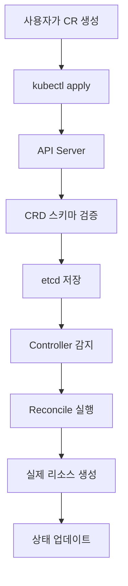
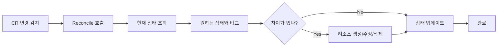

# CRD 기본 개념

## 🎯 학습 목표

이 문서를 통해 다음을 이해할 수 있습니다:
- CRD의 정의와 목적
- Kubernetes API 확장 메커니즘
- CRD vs Aggregated API 차이점
- CRD의 구성 요소와 동작 원리
- 실제 사용 사례와 장단점

## 🤔 CRD란?

**CRD (Custom Resource Definition)**는 Kubernetes API를 확장하여 사용자 정의 리소스를 추가할 수 있게 해주는 기능입니다.

### 간단한 비유
Kubernetes를 **레고 블록 세트**라고 생각해보세요:
- **기본 블록들**: Pod, Service, Deployment 등 (Kubernetes 기본 리소스)
- **CRD**: 새로운 모양의 블록을 만드는 **몰드(틀)**
- **Custom Resource**: 그 틀로 만든 **실제 블록**

### 왜 CRD가 필요한가?

#### 1. 도메인별 리소스 필요성
```yaml
# 예: 데이터베이스 관리
apiVersion: database.example.com/v1
kind: Database
metadata:
  name: my-mysql
spec:
  type: mysql
  version: "8.0"
  replicas: 3
  backup:
    enabled: true
    schedule: "0 2 * * *"
```

#### 2. 비즈니스 로직 캡슐화
- **복잡한 설정을 단순화**: 개발자는 간단한 YAML만 작성
- **자동화된 관리**: Controller가 복잡한 리소스 생성/관리 담당
- **일관된 정책**: 조직의 표준을 CRD에 내장

## 🏗️ Kubernetes API 확장 메커니즘

Kubernetes에서 API를 확장하는 방법은 크게 두 가지입니다:

### 1. CRD (Custom Resource Definition)
```yaml
# 간단한 YAML로 새로운 리소스 타입 정의
apiVersion: apiextensions.k8s.io/v1
kind: CustomResourceDefinition
metadata:
  name: websites.example.com
spec:
  group: example.com
  versions:
    - name: v1
      served: true
      storage: true
```

**장점:**
- ✅ **간단함**: YAML만으로 정의 가능
- ✅ **빠른 개발**: 복잡한 서버 코드 불필요
- ✅ **유지보수 용이**: Kubernetes가 자동으로 API 서버 제공

**단점:**
- ❌ **기능 제한**: 복잡한 비즈니스 로직 구현 어려움
- ❌ **성능**: 대용량 데이터 처리 시 성능 이슈

### 2. Aggregated API
```go
// 별도의 API 서버를 구현해야 함
type APIServer struct {
    // 복잡한 서버 로직
}
```

**장점:**
- ✅ **완전한 제어**: 모든 기능을 직접 구현 가능
- ✅ **성능**: 최적화된 성능 구현 가능
- ✅ **복잡한 로직**: 서버 사이드 로직 구현 가능

**단점:**
- ❌ **복잡성**: 별도의 API 서버 개발 필요
- ❌ **유지보수**: Kubernetes 업그레이드 시 호환성 관리 필요

### 언제 어떤 방법을 사용할까?

| 상황 | 권장 방법 | 이유 |
|------|-----------|------|
| **간단한 리소스 관리** | CRD | 빠른 개발, 유지보수 용이 |
| **복잡한 비즈니스 로직** | Aggregated API | 완전한 제어 가능 |
| **대용량 데이터 처리** | Aggregated API | 성능 최적화 가능 |
| **프로토타입/학습** | CRD | 빠른 시작 가능 |

## 🧩 CRD 구성 요소

CRD는 다음과 같은 핵심 구성 요소들로 이루어져 있습니다:

### 1. Custom Resource Definition (CRD)
**새로운 리소스 타입을 정의하는 스키마**

```yaml
apiVersion: apiextensions.k8s.io/v1
kind: CustomResourceDefinition
metadata:
  name: websites.example.com
spec:
  group: example.com          # API 그룹
  versions:                   # 지원하는 버전들
    - name: v1
      served: true            # API 서버에서 제공
      storage: true           # etcd에 저장
      schema:                 # OpenAPI v3 스키마
        openAPIV3Schema:
          type: object
          properties:
            spec:
              type: object
              properties:
                url:
                  type: string
                replicas:
                  type: integer
                  minimum: 1
                  maximum: 10
  scope: Namespaced          # Namespaced 또는 Cluster
  names:                     # 리소스 이름 정의
    plural: websites         # 복수형 (kubectl get websites)
    singular: website        # 단수형
    kind: Website           # Kind (YAML에서 사용)
    shortNames:             # 축약형
    - ws
```

**주요 특징:**
- 📋 **스키마 정의**: OpenAPI v3를 사용한 구조 정의
- 🔒 **검증 규칙**: 필드 타입, 범위, 필수값 등 자동 검증
- 📝 **문서화**: 스키마에서 자동으로 API 문서 생성
- 🔄 **버전 관리**: 여러 버전 동시 지원 가능

### 2. Custom Resource (CR)
**CRD로 정의된 리소스의 실제 인스턴스**

```yaml
apiVersion: example.com/v1
kind: Website
metadata:
  name: my-blog
  namespace: default
spec:
  url: "https://my-blog.com"
  replicas: 3
  image: "nginx:1.20"
status:
  readyReplicas: 3
  conditions:
  - type: Ready
    status: "True"
    lastTransitionTime: "2024-01-15T10:30:00Z"
```

**주요 특징:**
- 📄 **YAML/JSON 형태**: 선언적 리소스 정의
- 🎯 **kubectl 호환**: 기존 Kubernetes 도구들과 완벽 호환
- 📊 **상태 관리**: spec(원하는 상태)과 status(실제 상태) 분리
- 🏷️ **메타데이터**: 라벨, 어노테이션 등 Kubernetes 표준 메타데이터 사용

### 3. Controller
**CR의 상태를 관리하는 로직**

```go
// Controller의 핵심: Reconcile 함수
func (r *WebsiteReconciler) Reconcile(ctx context.Context, req ctrl.Request) (ctrl.Result, error) {
    // 1. Website 리소스 조회
    var website mygroupv1.Website
    if err := r.Get(ctx, req.NamespacedName, &website); err != nil {
        return ctrl.Result{}, client.IgnoreNotFound(err)
    }
    
    // 2. 원하는 상태와 실제 상태 비교
    deployment := &appsv1.Deployment{}
    if err := r.Get(ctx, types.NamespacedName{
        Name:      website.Name,
        Namespace: website.Namespace,
    }, deployment); err != nil {
        // 3. 실제 상태가 없으면 생성
        if errors.IsNotFound(err) {
            return r.createDeployment(ctx, &website)
        }
        return ctrl.Result{}, err
    }
    
    // 4. 상태 업데이트
    return r.updateStatus(ctx, &website, deployment)
}
```

**주요 특징:**
- 🔄 **Reconcile Loop**: 지속적으로 원하는 상태와 실제 상태를 비교
- 🎯 **상태 조정**: 차이가 있으면 자동으로 조정
- 🛡️ **에러 처리**: 실패 시 재시도 및 에러 상태 관리
- 📊 **상태 업데이트**: CR의 status 필드에 현재 상태 기록

## 🔄 CRD 동작 원리

### 1. 리소스 생성 과정


### 2. Controller 동작 과정


## ✅ CRD의 장점

### 1. **API 확장성**
```yaml
# 도메인별 리소스 정의 가능
apiVersion: database.example.com/v1
kind: Database
---
apiVersion: cache.example.com/v1
kind: Redis
---
apiVersion: monitoring.example.com/v1
kind: AlertRule
```

### 2. **일관된 관리**
- ✅ **kubectl 호환**: `kubectl get websites`, `kubectl describe website`
- ✅ **Dashboard 지원**: Kubernetes Dashboard에서 시각적 관리
- ✅ **YAML 기반**: 선언적 설정으로 GitOps 지원
- ✅ **API 표준**: RESTful API로 일관된 인터페이스

### 3. **권한 관리 (RBAC)**
```yaml
# 세밀한 접근 제어
apiVersion: rbac.authorization.k8s.io/v1
kind: Role
metadata:
  name: website-admin
rules:
- apiGroups: ["example.com"]
  resources: ["websites"]
  verbs: ["get", "list", "create", "update", "delete"]
```

### 4. **자동 검증**
```yaml
# OpenAPI 스키마로 자동 검증
schema:
  openAPIV3Schema:
    type: object
    properties:
      spec:
        type: object
        required: ["url", "replicas"]
        properties:
          url:
            type: string
            pattern: "^https?://"
          replicas:
            type: integer
            minimum: 1
            maximum: 10
```

### 5. **버전 관리**
```yaml
# 여러 버전 동시 지원
versions:
- name: v1
  served: true
  storage: false  # 이전 버전
- name: v2
  served: true
  storage: true   # 현재 저장 버전
```

## ❌ CRD의 한계

### 1. **기능 제한**
- ❌ **서버 사이드 로직**: 복잡한 비즈니스 로직 구현 어려움
- ❌ **커스텀 API**: GET, POST 외의 커스텀 API 엔드포인트 불가
- ❌ **서브리소스**: `/status`, `/scale` 외의 서브리소스 제한

### 2. **성능 이슈**
- ❌ **대용량 데이터**: 큰 객체의 경우 성능 저하
- ❌ **복잡한 쿼리**: 복잡한 필터링이나 검색 기능 제한
- ❌ **실시간 처리**: 실시간 데이터 처리에 부적합

### 3. **개발 복잡성**
- ❌ **Controller 필요**: CRD만으로는 동작하지 않음
- ❌ **에러 처리**: 복잡한 에러 상황 처리 어려움
- ❌ **테스트**: Controller 로직 테스트 복잡성

## 🌟 실제 사용 사례

### 1. **Database Operator**
```yaml
apiVersion: database.example.com/v1
kind: Database
metadata:
  name: my-mysql
spec:
  type: mysql
  version: "8.0"
  replicas: 3
  storage:
    size: "100Gi"
    class: "fast-ssd"
  backup:
    enabled: true
    schedule: "0 2 * * *"
    retention: "30d"
```

### 2. **Monitoring Operator**
```yaml
apiVersion: monitoring.example.com/v1
kind: AlertRule
metadata:
  name: high-cpu-usage
spec:
  condition: "cpu_usage > 80%"
  duration: "5m"
  severity: "warning"
  actions:
  - type: "slack"
    channel: "#alerts"
  - type: "email"
    recipients: ["admin@example.com"]
```

### 3. **CI/CD Operator**
```yaml
apiVersion: cicd.example.com/v1
kind: Pipeline
metadata:
  name: web-app-deploy
spec:
  source:
    repository: "https://github.com/example/web-app"
    branch: "main"
  stages:
  - name: "test"
    image: "node:16"
    commands: ["npm test"]
  - name: "build"
    image: "docker:latest"
    commands: ["docker build -t web-app ."]
  - name: "deploy"
    image: "kubectl:latest"
    commands: ["kubectl apply -f k8s/"]
```

## 🎯 CRD vs 다른 기술 비교

### CRD vs Helm Chart
| 특징 | CRD | Helm Chart |
|------|-----|------------|
| **목적** | 새로운 리소스 타입 정의 | 기존 리소스들의 패키징 |
| **복잡성** | 높음 (Controller 필요) | 낮음 (템플릿 기반) |
| **재사용성** | 도메인별 특화 | 범용적 |
| **학습 곡선** | 가파름 | 완만함 |

### CRD vs Operator
| 특징 | CRD | Operator |
|------|-----|----------|
| **관계** | CRD는 Operator의 일부 | CRD + Controller = Operator |
| **기능** | 리소스 정의만 | 리소스 정의 + 관리 로직 |
| **사용 목적** | API 확장 | 애플리케이션 자동화 |

## 📚 핵심 개념 정리

### 1. **CRD의 본질**
- Kubernetes API를 확장하는 **스키마 정의**
- 새로운 리소스 타입을 **선언적으로 정의**
- **Controller가 실제 동작을 담당**

### 2. **CRD 개발 과정**
1. **CRD 정의**: OpenAPI 스키마로 리소스 구조 정의
2. **Controller 개발**: Reconcile 로직으로 리소스 관리
3. **Webhook 구현**: 검증 및 기본값 설정 (선택사항)
4. **테스트**: 단위/통합/E2E 테스트 작성
5. **배포**: CRD, RBAC, Controller 배포

### 3. **성공적인 CRD 설계 원칙**
- ✅ **단순성**: 복잡한 로직보다는 단순한 리소스 정의
- ✅ **일관성**: Kubernetes API 컨벤션 준수
- ✅ **확장성**: 미래 요구사항을 고려한 설계
- ✅ **테스트**: 충분한 테스트 커버리지
- ✅ **문서화**: 명확한 API 문서와 예제

## 🚀 다음 단계

이제 CRD의 기본 개념을 이해했으니, 실제 개발 환경을 구축해보겠습니다:

- [개발 환경 설정](./02-environment-setup.md) - kubectl, Go, kubebuilder 설치
- [첫 번째 CRD 만들기](./03-first-crd.md) - 간단한 CRD 정의 및 배포
- [kubebuilder 가이드](./04-kubebuilder-guide.md) - 프레임워크를 활용한 CRD 개발

## 💡 학습 팁

1. **실습 중심**: 개념만 이해하지 말고 직접 만들어보세요
2. **점진적 학습**: 간단한 CRD부터 시작해서 점점 복잡하게
3. **커뮤니티 활용**: GitHub의 오픈소스 Operator들을 참고하세요
4. **문서 읽기**: Kubernetes 공식 문서를 꼼꼼히 읽어보세요
