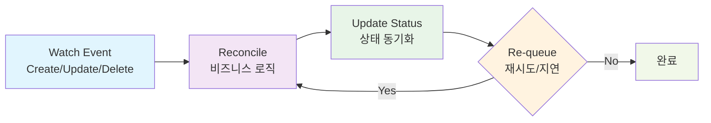

# 컨트롤러 개발

## 컨트롤러란?

**컨트롤러**는 Kubernetes의 핵심 개념으로, 원하는 상태(Desired State)와 실제 상태(Actual State)를 지속적으로 비교하여 클러스터를 원하는 상태로 유지하는 역할을 합니다.

[kubebuilder 사용법](./04-kubebuilder-guide.md)에서 `advanced-crd-project` 프로젝트 구조와 API 타입을 정의했으니, 이제 실제 비즈니스 로직을 구현하는 컨트롤러를 개발해보겠습니다.

**📝 참고**: 이 문서는 `docs/04-kubebuilder-guide.md`에서 생성한 `advanced-crd-project`를 계속 사용합니다.

## 컨트롤러의 동작 원리

### Reconcile이란?

**Reconcile**은 Kubernetes 컨트롤러의 핵심 개념으로, "조정" 또는 "화해"라는 의미입니다. 컨트롤러는 지속적으로 다음을 수행합니다:

1. **원하는 상태(Desired State) 확인**: 사용자가 정의한 리소스의 스펙
2. **실제 상태(Actual State) 확인**: 클러스터에 실제로 존재하는 리소스의 상태
3. **차이점 분석**: 원하는 상태와 실제 상태 간의 차이점 파악
4. **조정 작업 수행**: 실제 상태를 원하는 상태로 맞추기 위한 작업 실행

이 과정을 **Reconcile 루프**라고 하며, 리소스가 원하는 상태에 도달할 때까지 반복됩니다.

### 1. Reconcile 루프



**Reconcile 루프의 동작 과정:**

1. **Watch Event**: Kubernetes API 서버에서 리소스 변경 감지
2. **Reconcile**: 원하는 상태와 실제 상태를 비교하여 조정 작업 수행
3. **Update Status**: 리소스의 상태를 업데이트
4. **Re-queue**: 필요시 재시도하거나 일정 시간 후 다시 조정

### 2. 기본 구조

```go
import (
    "context"
    
    "k8s.io/apimachinery/pkg/runtime"
    ctrl "sigs.k8s.io/controller-runtime"
    "sigs.k8s.io/controller-runtime/pkg/client"
    logf "sigs.k8s.io/controller-runtime/pkg/log"
    
    mygroupv1 "github.com/britko/advanced-crd-project/api/v1"
)

type WebsiteReconciler struct {
    client.Client        // Kubernetes API 클라이언트
    Scheme *runtime.Scheme // 타입 스키마
}

func (r *WebsiteReconciler) Reconcile(ctx context.Context, req ctrl.Request) (ctrl.Result, error) {
    _ = logf.FromContext(ctx)  // 로거는 context에서 가져옴
    
    // 1. 리소스 조회
    // 2. 비즈니스 로직 실행
    // 3. 상태 업데이트
    // 4. 결과 반환
}
```

**📝 참고**: 
- **로거 사용**: `logr.Logger` 필드 대신 `logf.FromContext(ctx)`로 context에서 로거를 가져옴
- **Import**: `logf "sigs.k8s.io/controller-runtime/pkg/log"` 패키지 사용
- **실제 구조**: kubebuilder가 생성한 실제 컨트롤러 구조와 일치

## 컨트롤러 구현 단계

### 1단계: 기본 구조 설정

```go
//+kubebuilder:rbac:groups=mygroup.example.com,resources=websites,verbs=get;list;watch;create;update;patch;delete
//+kubebuilder:rbac:groups=mygroup.example.com,resources=websites/status,verbs=get;update;patch
//+kubebuilder:rbac:groups=mygroup.example.com,resources=websites/finalizers,verbs=update
//+kubebuilder:rbac:groups=apps,resources=deployments,verbs=get;list;watch;create;update;patch;delete
//+kubebuilder:rbac:groups=core,resources=services,verbs=get;list;watch;create;update;patch;delete

func (r *WebsiteReconciler) Reconcile(ctx context.Context, req ctrl.Request) (ctrl.Result, error) {
    logger := log.FromContext(ctx)
    
    // Website 리소스 조회
    var website mygroupv1.Website
    if err := r.Get(ctx, req.NamespacedName, &website); err != nil {
        return ctrl.Result{}, client.IgnoreNotFound(err)
    }
    
    logger.Info("Website 조정 시작", "name", website.Name, "namespace", website.Namespace)
    
    // 비즈니스 로직 실행
    if err := r.reconcileWebsite(ctx, &website); err != nil {
        return ctrl.Result{}, err
    }
    
    return ctrl.Result{}, nil
}
```

### 2단계: 비즈니스 로직 구현

```go
func (r *WebsiteReconciler) reconcileWebsite(ctx context.Context, website *mygroupv1.Website) error {
    // Deployment 생성/업데이트
    if err := r.reconcileDeployment(ctx, website); err != nil {
        return fmt.Errorf("failed to reconcile deployment: %w", err)
    }
    
    // Service 생성/업데이트
    if err := r.reconcileService(ctx, website); err != nil {
        return fmt.Errorf("failed to reconcile service: %w", err)
    }
    
    // 상태 업데이트
    if err := r.updateStatus(ctx, website); err != nil {
        return fmt.Errorf("failed to update status: %w", err)
    }
    
    return nil
}
```

### 3단계: 하위 리소스 관리

#### Deployment 관리

```go
func (r *WebsiteReconciler) reconcileDeployment(ctx context.Context, website *mygroupv1.Website) error {
    // 기존 Deployment 조회
    var deployment appsv1.Deployment
    err := r.Get(ctx, types.NamespacedName{
        Name:      website.Name,
        Namespace: website.Namespace,
    }, &deployment)
    
    if client.IgnoreNotFound(err) != nil {
        return err
    }
    
    // Deployment가 존재하지 않으면 생성
    if err != nil {
        deployment = r.buildDeployment(website)
        if err := r.Create(ctx, &deployment); err != nil {
            return err
        }
        return nil
    }
    
    // Deployment 업데이트
    if r.deploymentNeedsUpdate(&deployment, website) {
        r.updateDeployment(&deployment, website)
        if err := r.Update(ctx, &deployment); err != nil {
            return err
        }
    }
    
    return nil
}

func (r *WebsiteReconciler) buildDeployment(website *mygroupv1.Website) appsv1.Deployment {
    return appsv1.Deployment{
        ObjectMeta: metav1.ObjectMeta{
            Name:      website.Name,
            Namespace: website.Namespace,
            Labels:    r.getLabels(website),
            OwnerReferences: []metav1.OwnerReference{
                *metav1.NewControllerRef(website, mygroupv1.GroupVersion.WithKind("Website")),
            },
        },
        Spec: appsv1.DeploymentSpec{
            Replicas: &website.Spec.Replicas,
            Selector: &metav1.LabelSelector{
                MatchLabels: r.getLabels(website),
            },
            Template: corev1.PodTemplateSpec{
                ObjectMeta: metav1.ObjectMeta{
                    Labels: r.getLabels(website),
                },
                Spec: corev1.PodSpec{
                    Containers: []corev1.Container{
                        {
                            Name:  "website",
                            Image: website.Spec.Image,
                            Ports: []corev1.ContainerPort{
                                {
                                    ContainerPort: website.Spec.Port,
                                },
                            },
                        },
                    },
                },
            },
        },
    }
}
```

#### Service 관리

```go
func (r *WebsiteReconciler) reconcileService(ctx context.Context, website *mygroupv1.Website) error {
    var service corev1.Service
    err := r.Get(ctx, types.NamespacedName{
        Name:      website.Name,
        Namespace: website.Namespace,
    }, &service)
    
    if client.IgnoreNotFound(err) != nil {
        return err
    }
    
    if err != nil {
        service = r.buildService(website)
        if err := r.Create(ctx, &service); err != nil {
            return err
        }
        return nil
    }
    
    return nil
}

func (r *WebsiteReconciler) buildService(website *mygroupv1.Website) corev1.Service {
    return corev1.Service{
        ObjectMeta: metav1.ObjectMeta{
            Name:      website.Name,
            Namespace: website.Namespace,
            Labels:    r.getLabels(website),
            OwnerReferences: []metav1.OwnerReference{
                *metav1.NewControllerRef(website, mygroupv1.GroupVersion.WithKind("Website")),
            },
        },
        Spec: corev1.ServiceSpec{
            Selector: r.getLabels(website),
            Ports: []corev1.ServicePort{
                {
                    Port:       website.Spec.Port,
                    TargetPort: intstr.FromInt(int(website.Spec.Port)),
                },
            },
        },
    }
}
```

### 4단계: 상태 관리

```go
func (r *WebsiteReconciler) updateStatus(ctx context.Context, website *mygroupv1.Website) error {
    // Deployment 상태 확인
    var deployment appsv1.Deployment
    err := r.Get(ctx, types.NamespacedName{
        Name:      website.Name,
        Namespace: website.Namespace,
    }, &deployment)
    
    if err != nil {
        return err
    }
    
    // 상태 업데이트
    website.Status.AvailableReplicas = deployment.Status.AvailableReplicas
    
    // 조건 업데이트
    r.updateConditions(website, &deployment)
    
    // 상태 저장
    return r.Status().Update(ctx, website)
}

func (r *WebsiteReconciler) updateConditions(website *mygroupv1.Website, deployment *appsv1.Deployment) {
    // 사용 가능한 복제본이 0인 경우
    if deployment.Status.AvailableReplicas == 0 {
        r.setCondition(website, "Available", metav1.ConditionFalse, "NoReplicas", "사용 가능한 복제본이 없습니다")
    } else {
        r.setCondition(website, "Available", metav1.ConditionTrue, "ReplicasReady", "복제본이 준비되었습니다")
    }
    
    // 원하는 복제본 수와 일치하는 경우
    if deployment.Status.AvailableReplicas == *deployment.Spec.Replicas {
        r.setCondition(website, "Ready", metav1.ConditionTrue, "AllReplicasReady", "모든 복제본이 준비되었습니다")
    } else {
        r.setCondition(website, "Ready", metav1.ConditionFalse, "ReplicasNotReady", "일부 복제본이 준비되지 않았습니다")
    }
}

func (r *WebsiteReconciler) setCondition(website *mygroupv1.Website, conditionType string, status metav1.ConditionStatus, reason, message string) {
    now := metav1.Now()
    
    for i := range website.Status.Conditions {
        if website.Status.Conditions[i].Type == conditionType {
            if website.Status.Conditions[i].Status != status {
                website.Status.Conditions[i].LastTransitionTime = now
            }
            website.Status.Conditions[i].Status = status
            website.Status.Conditions[i].Reason = reason
            website.Status.Conditions[i].Message = message
            return
        }
    }
    
    website.Status.Conditions = append(website.Status.Conditions, metav1.Condition{
        Type:               conditionType,
        Status:             status,
        Reason:             reason,
        Message:            message,
        LastTransitionTime: now,
    })
}
```

## 에러 처리 및 재시도

### 1. 에러 분류

```go
func (r *WebsiteReconciler) Reconcile(ctx context.Context, req ctrl.Request) (ctrl.Result, error) {
    // ... 리소스 조회 ...
    
    if err := r.reconcileWebsite(ctx, &website); err != nil {
        // 일시적 에러인 경우 재시도
        if isTransientError(err) {
            return ctrl.Result{RequeueAfter: time.Second * 30}, nil
        }
        
        // 영구적 에러인 경우 상태 업데이트
        r.setCondition(&website, "Failed", metav1.ConditionTrue, "ReconcileError", err.Error())
        r.Status().Update(ctx, &website)
        
        return ctrl.Result{}, err
    }
    
    return ctrl.Result{}, nil
}

func isTransientError(err error) bool {
    // 네트워크 에러, 일시적 리소스 부족 등
    return strings.Contains(err.Error(), "connection refused") ||
           strings.Contains(err.Error(), "resource quota exceeded")
}
```

### 2. 지연 재시도

```go
func (r *WebsiteReconciler) Reconcile(ctx context.Context, req ctrl.Request) (ctrl.Result, error) {
    // ... 비즈니스 로직 ...
    
    // 성공적으로 완료되었지만 나중에 다시 확인하고 싶은 경우
    return ctrl.Result{RequeueAfter: time.Minute * 5}, nil
}
```

## 테스트 작성

### 1. 단위 테스트

```go
func TestWebsiteReconciler_Reconcile(t *testing.T) {
    // 테스트 케이스 설정
    tests := []struct {
        name    string
        website *mygroupv1.Website
        wantErr bool
    }{
        {
            name: "정상적인 Website 조정",
            website: &mygroupv1.Website{
                ObjectMeta: metav1.ObjectMeta{
                    Name:      "test-website",
                    Namespace: "default",
                },
                Spec: mygroupv1.WebsiteSpec{
                    URL:      "https://example.com",
                    Replicas: 3,
                },
            },
            wantErr: false,
        },
    }
    
    for _, tt := range tests {
        t.Run(tt.name, func(t *testing.T) {
            // 테스트 실행
            // ...
        })
    }
}
```

### 2. 통합 테스트

```go
func TestWebsiteReconciler_Integration(t *testing.T) {
    // 테스트 환경 설정
    env := &envtest.Environment{
        CRDDirectoryPaths: []string{filepath.Join("..", "..", "config", "crd", "bases")},
    }
    
    cfg, err := env.Start()
    require.NoError(t, err)
    defer env.Stop()
    
    // 컨트롤러 실행
    // ...
}
```

## 성능 최적화

### 1. 캐싱 활용

```go
func (r *WebsiteReconciler) SetupWithManager(mgr ctrl.Manager) error {
    return ctrl.NewControllerManagedBy(mgr).
        For(&mygroupv1.Website{}).
        Owns(&appsv1.Deployment{}).
        Owns(&corev1.Service{}).
        WithOptions(controller.Options{
            MaxConcurrentReconciles: 5, // 동시 조정 수 제한
        }).
        Complete(r)
}
```

### 2. 이벤트 필터링

```go
func (r *WebsiteReconciler) SetupWithManager(mgr ctrl.Manager) error {
    return ctrl.NewControllerManagedBy(mgr).
        For(&mygroupv1.Website{}).
        WithEventFilter(predicate.Funcs{
            CreateFunc: func(e event.CreateEvent) bool {
                // 특정 조건에서만 처리
                return true
            },
            UpdateFunc: func(e event.UpdateEvent) bool {
                // 의미 있는 변경사항만 처리
                return r.hasMeaningfulChange(e.ObjectOld, e.ObjectNew)
            },
        }).
        Complete(r)
}
```

## 다음 단계

컨트롤러 개발을 완료했습니다! 이제 CRD의 데이터 무결성을 보장하는 고급 기능들을 구현해보겠습니다:

- [웹훅 구현](./06-webhooks.md) - 검증 및 변환 웹훅 구현
- [검증 및 기본값 설정](./07-validation-defaulting.md) - 스키마 검증 및 기본값

## 문제 해결

### 일반적인 문제들

1. **무한 루프**: 상태 업데이트 시 무한 재시도 방지
2. **권한 문제**: RBAC 설정 확인
3. **리소스 충돌**: OwnerReference 설정으로 가비지 컬렉션 활용

### 디버깅 팁

```bash
# 컨트롤러 로그 확인
kubectl logs -n advanced-crd-project-system deployment/advanced-crd-project-controller-manager -f

# 특정 리소스 이벤트 확인
kubectl describe website website-sample

# API 서버 로그 확인
kubectl logs -n kube-system kube-apiserver-kind-control-plane
```
