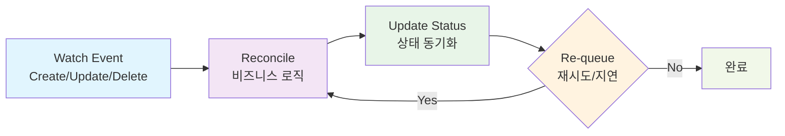

# 컨트롤러 개발

## 컨트롤러란?

**컨트롤러**는 Kubernetes의 핵심 개념으로, 원하는 상태(Desired State)와 실제 상태(Actual State)를 지속적으로 비교하여 클러스터를 원하는 상태로 유지하는 역할을 합니다.

[kubebuilder 사용법](./04-kubebuilder-guide.md)에서 `advanced-crd-project` 프로젝트 구조와 API 타입을 정의했으니, 이제 실제 비즈니스 로직을 구현하는 컨트롤러를 개발해보겠습니다.

**📝 참고**: 이 문서는 `docs/04-kubebuilder-guide.md`에서 생성한 `advanced-crd-project`를 계속 사용합니다.

## 컨트롤러의 동작 원리

### Reconcile이란?

**Reconcile**은 Kubernetes 컨트롤러의 핵심 개념으로, "조정" 또는 "화해"라는 의미입니다. 컨트롤러는 지속적으로 다음을 수행합니다:

1. **원하는 상태(Desired State) 확인**: 사용자가 정의한 리소스의 스펙
2. **실제 상태(Actual State) 확인**: 클러스터에 실제로 존재하는 리소스의 상태
3. **차이점 분석**: 원하는 상태와 실제 상태 간의 차이점 파악
4. **조정 작업 수행**: 실제 상태를 원하는 상태로 맞추기 위한 작업 실행

이 과정을 **Reconcile 루프**라고 하며, 리소스가 원하는 상태에 도달할 때까지 반복됩니다.

### Reconcile 루프



**Reconcile 루프의 동작 과정:**

1. **Watch Event**: Kubernetes API 서버에서 리소스 변경 감지
2. **Reconcile**: 원하는 상태와 실제 상태를 비교하여 조정 작업 수행
3. **Update Status**: 리소스의 상태를 업데이트
4. **Re-queue**: 필요시 재시도하거나 일정 시간 후 다시 조정

## 완성된 컨트롤러 코드

먼저 완성된 컨트롤러 코드를 전체적으로 살펴보겠습니다:

```go
package controller

import (
    "context"
    "fmt"
    "time"
    
    appsv1 "k8s.io/api/apps/v1"
    corev1 "k8s.io/api/core/v1"
    "k8s.io/apimachinery/pkg/api/errors"
    "k8s.io/apimachinery/pkg/runtime"
    "k8s.io/apimachinery/pkg/types"
    "k8s.io/apimachinery/pkg/util/intstr"
    metav1 "k8s.io/apimachinery/pkg/apis/meta/v1"
    ctrl "sigs.k8s.io/controller-runtime"
    "sigs.k8s.io/controller-runtime/pkg/client"
    logf "sigs.k8s.io/controller-runtime/pkg/log"
    
    mygroupv1 "github.com/britko/advanced-crd-project/api/v1"
)

// WebsiteReconciler reconciles a Website object
type WebsiteReconciler struct {
    client.Client
    Scheme *runtime.Scheme
}

//+kubebuilder:rbac:groups=mygroup.example.com,resources=websites,verbs=get;list;watch;create;update;patch;delete
//+kubebuilder:rbac:groups=mygroup.example.com,resources=websites/status,verbs=get;update;patch
//+kubebuilder:rbac:groups=mygroup.example.com,resources=websites/finalizers,verbs=update
//+kubebuilder:rbac:groups=apps,resources=deployments,verbs=get;list;watch;create;update;patch;delete
//+kubebuilder:rbac:groups=core,resources=services,verbs=get;list;watch;create;update;patch;delete

func (r *WebsiteReconciler) Reconcile(ctx context.Context, req ctrl.Request) (ctrl.Result, error) {
    logger := logf.FromContext(ctx)
    
    // Website 리소스 조회
    var website mygroupv1.Website
    if err := r.Get(ctx, req.NamespacedName, &website); err != nil {
        if errors.IsNotFound(err) {
            logger.Info("Website resource not found. Ignoring since object must be deleted.")
            return ctrl.Result{}, nil
        }
        logger.Error(err, "Failed to get Website")
        return ctrl.Result{}, err
    }
    
    // Deployment 조정
    if err := r.reconcileDeployment(ctx, &website); err != nil {
        logger.Error(err, "Failed to reconcile Deployment")
        return ctrl.Result{}, err
    }
    
    // Service 조정
    if err := r.reconcileService(ctx, &website); err != nil {
        logger.Error(err, "Failed to reconcile Service")
        return ctrl.Result{}, err
    }
    
    // 상태 업데이트
    if err := r.updateStatus(ctx, &website); err != nil {
        logger.Error(err, "Failed to update status")
        return ctrl.Result{RequeueAfter: time.Second * 5}, err
    }
    
    return ctrl.Result{}, nil
}

// reconcileDeployment는 Deployment를 조정합니다
func (r *WebsiteReconciler) reconcileDeployment(ctx context.Context, website *mygroupv1.Website) error {
    var deployment appsv1.Deployment
    err := r.Get(ctx, types.NamespacedName{
        Name:      website.Name,
        Namespace: website.Namespace,
    }, &deployment)
    
    if err != nil && !errors.IsNotFound(err) {
        return err
    }
    
    if errors.IsNotFound(err) {
        // Deployment 생성
        deployment = r.buildDeployment(website)
        if err := r.Create(ctx, &deployment); err != nil {
            return err
        }
        return nil
    }
    
    // Deployment 업데이트 확인
    if r.deploymentNeedsUpdate(&deployment, website) {
        r.updateDeployment(&deployment, website)
        if err := r.Update(ctx, &deployment); err != nil {
            return err
        }
    }
    
    return nil
}

// reconcileService는 Service를 조정합니다
func (r *WebsiteReconciler) reconcileService(ctx context.Context, website *mygroupv1.Website) error {
    var service corev1.Service
    err := r.Get(ctx, types.NamespacedName{
        Name:      website.Name,
        Namespace: website.Namespace,
    }, &service)
    
    if err != nil && !errors.IsNotFound(err) {
        return err
    }
    
    if errors.IsNotFound(err) {
        // Service 생성
        service = r.buildService(website)
        if err := r.Create(ctx, &service); err != nil {
            return err
        }
        return nil
    }
    
    return nil
}

// updateStatus는 Website의 상태를 업데이트합니다
func (r *WebsiteReconciler) updateStatus(ctx context.Context, website *mygroupv1.Website) error {
    // Deployment 상태 확인
    var deployment appsv1.Deployment
    if err := r.Get(ctx, types.NamespacedName{
        Name:      website.Name,
        Namespace: website.Namespace,
    }, &deployment); err != nil {
        return err
    }
    
    // 상태 업데이트
    website.Status.AvailableReplicas = deployment.Status.AvailableReplicas
    
    if deployment.Status.ReadyReplicas == website.Spec.Replicas {
        website.Status.Conditions = []metav1.Condition{
            {
                Type:               "Ready",
                Status:             metav1.ConditionTrue,
                LastTransitionTime: metav1.Now(),
                Reason:             "AllReplicasReady",
                Message:            fmt.Sprintf("All %d replicas are ready", website.Spec.Replicas),
            },
        }
    } else {
        website.Status.Conditions = []metav1.Condition{
            {
                Type:               "Ready",
                Status:             metav1.ConditionFalse,
                LastTransitionTime: metav1.Now(),
                Reason:             "ReplicasNotReady",
                Message:            fmt.Sprintf("%d/%d replicas are ready", deployment.Status.ReadyReplicas, website.Spec.Replicas),
            },
        }
    }
    
    return r.Status().Update(ctx, website)
}

// buildDeployment는 Website 스펙으로부터 Deployment를 생성합니다
func (r *WebsiteReconciler) buildDeployment(website *mygroupv1.Website) appsv1.Deployment {
    return appsv1.Deployment{
        ObjectMeta: metav1.ObjectMeta{
            Name:      website.Name,
            Namespace: website.Namespace,
            Labels:    r.getLabels(website),
            OwnerReferences: []metav1.OwnerReference{
                *metav1.NewControllerRef(website, mygroupv1.GroupVersion.WithKind("Website")),
            },
        },
        Spec: appsv1.DeploymentSpec{
            Replicas: &website.Spec.Replicas,
            Selector: &metav1.LabelSelector{
                MatchLabels: r.getLabels(website),
            },
            Template: corev1.PodTemplateSpec{
                ObjectMeta: metav1.ObjectMeta{
                    Labels: r.getLabels(website),
                },
                Spec: corev1.PodSpec{
                    Containers: []corev1.Container{
                        {
                            Name:  "website",
                            Image: website.Spec.Image,
                            Ports: []corev1.ContainerPort{
                                {
                                    ContainerPort: website.Spec.Port,
                                },
                            },
                        },
                    },
                },
            },
        },
    }
}

// buildService는 Website 스펙으로부터 Service를 생성합니다
func (r *WebsiteReconciler) buildService(website *mygroupv1.Website) corev1.Service {
    return corev1.Service{
        ObjectMeta: metav1.ObjectMeta{
            Name:      website.Name,
            Namespace: website.Namespace,
            Labels:    r.getLabels(website),
            OwnerReferences: []metav1.OwnerReference{
                *metav1.NewControllerRef(website, mygroupv1.GroupVersion.WithKind("Website")),
            },
        },
        Spec: corev1.ServiceSpec{
            Type: corev1.ServiceTypeClusterIP,
            Ports: []corev1.ServicePort{
                {
                    Port:       80,
                    TargetPort: intstr.FromInt(int(website.Spec.Port)),
                    Protocol:   corev1.ProtocolTCP,
                },
            },
            Selector: r.getLabels(website),
        },
    }
}

// getLabels는 일관된 라벨을 반환합니다
func (r *WebsiteReconciler) getLabels(website *mygroupv1.Website) map[string]string {
    return map[string]string{
        "app":     "website",
        "website": website.Name,
    }
}

// deploymentNeedsUpdate는 Deployment 업데이트가 필요한지 확인합니다
func (r *WebsiteReconciler) deploymentNeedsUpdate(deployment *appsv1.Deployment, website *mygroupv1.Website) bool {
    if *deployment.Spec.Replicas != website.Spec.Replicas {
        return true
    }
    if deployment.Spec.Template.Spec.Containers[0].Image != website.Spec.Image {
        return true
    }
    if deployment.Spec.Template.Spec.Containers[0].Ports[0].ContainerPort != website.Spec.Port {
        return true
    }
    return false
}

// updateDeployment는 Deployment를 업데이트합니다
func (r *WebsiteReconciler) updateDeployment(deployment *appsv1.Deployment, website *mygroupv1.Website) {
    deployment.Spec.Replicas = &website.Spec.Replicas
    deployment.Spec.Template.Spec.Containers[0].Image = website.Spec.Image
    deployment.Spec.Template.Spec.Containers[0].Ports[0].ContainerPort = website.Spec.Port
}

// SetupWithManager sets up the controller with the Manager.
func (r *WebsiteReconciler) SetupWithManager(mgr ctrl.Manager) error {
    return ctrl.NewControllerManagedBy(mgr).
        For(&mygroupv1.Website{}).
        Owns(&appsv1.Deployment{}).
        Owns(&corev1.Service{}).
        Complete(r)
}
```

## 컨트롤러 개발 단계 개요

컨트롤러 개발은 다음과 같은 8단계로 구성됩니다:

```
1단계: 기본 구조 및 Import
    ↓
2단계: RBAC 권한 설정
    ↓
3단계: 메인 Reconcile 함수
    ↓
4단계: Deployment 관리
    ↓
5단계: Service 관리
    ↓
6단계: 상태 관리
    ↓
7단계: 헬퍼 함수들
    ↓
8단계: 컨트롤러 등록
```

### 각 단계별 설명

**1단계: 기본 구조 및 Import**
- 컨트롤러 패키지와 필요한 모든 import 설정
- `WebsiteReconciler` 구조체 정의

**2단계: RBAC 권한 설정**
- Kubernetes 리소스에 대한 접근 권한 설정
- `//+kubebuilder:rbac` 마커로 권한 정의

**3단계: 메인 Reconcile 함수**
- 컨트롤러의 핵심 로직
- Website 리소스 조회 및 각 하위 리소스 조정 호출

**4단계: Deployment 관리**
- Deployment 생성/업데이트/삭제 로직
- `reconcileDeployment` 함수 구현

**5단계: Service 관리**
- Service 생성/업데이트/삭제 로직
- `reconcileService` 함수 구현

**6단계: 상태 관리**
- Website 리소스의 상태 업데이트
- `updateStatus` 함수 구현

**7단계: 헬퍼 함수들**
- 재사용 가능한 유틸리티 함수들
- `getLabels`, `buildDeployment`, `buildService` 등

**8단계: 컨트롤러 등록**
- Manager에 컨트롤러 등록
- `SetupWithManager` 함수 구현

## 단계별 구현 가이드

이제 위의 완성된 코드를 단계별로 분해해서 설명하겠습니다.

### 1단계: 기본 구조 및 Import

**목표**: 컨트롤러의 기본 구조와 필요한 import 설정

```go
package controller

import (
    "context"
    "fmt"
    "time"
    
    appsv1 "k8s.io/api/apps/v1"
    corev1 "k8s.io/api/core/v1"
    "k8s.io/apimachinery/pkg/api/errors"
    "k8s.io/apimachinery/pkg/runtime"
    "k8s.io/apimachinery/pkg/types"
    "k8s.io/apimachinery/pkg/util/intstr"
    metav1 "k8s.io/apimachinery/pkg/apis/meta/v1"
    ctrl "sigs.k8s.io/controller-runtime"
    "sigs.k8s.io/controller-runtime/pkg/client"
    logf "sigs.k8s.io/controller-runtime/pkg/log"
    
    mygroupv1 "github.com/britko/advanced-crd-project/api/v1"
)

// WebsiteReconciler reconciles a Website object
type WebsiteReconciler struct {
    client.Client
    Scheme *runtime.Scheme
}
```

**📝 설명**:
- **Import**: Deployment, Service, Pod 관리에 필요한 모든 타입들
- **Struct**: `client.Client`로 Kubernetes API 호출, `Scheme`으로 타입 변환

### 2단계: RBAC 권한 설정

**목표**: 컨트롤러가 필요한 리소스에 접근할 수 있도록 권한 설정

```go
//+kubebuilder:rbac:groups=mygroup.example.com,resources=websites,verbs=get;list;watch;create;update;patch;delete
//+kubebuilder:rbac:groups=mygroup.example.com,resources=websites/status,verbs=get;update;patch
//+kubebuilder:rbac:groups=mygroup.example.com,resources=websites/finalizers,verbs=update
//+kubebuilder:rbac:groups=apps,resources=deployments,verbs=get;list;watch;create;update;patch;delete
//+kubebuilder:rbac:groups=core,resources=services,verbs=get;list;watch;create;update;patch;delete
```

**📝 설명**:
- **Website 리소스**: CRUD 모든 권한 + 상태 업데이트 권한
- **Deployment**: 생성/관리 권한
- **Service**: 생성/관리 권한

### 3단계: 메인 Reconcile 함수

**목표**: 컨트롤러의 핵심 로직 구현

```go
func (r *WebsiteReconciler) Reconcile(ctx context.Context, req ctrl.Request) (ctrl.Result, error) {
    logger := logf.FromContext(ctx)
    
    // Website 리소스 조회
    var website mygroupv1.Website
    if err := r.Get(ctx, req.NamespacedName, &website); err != nil {
        if errors.IsNotFound(err) {
            logger.Info("Website resource not found. Ignoring since object must be deleted.")
            return ctrl.Result{}, nil
        }
        logger.Error(err, "Failed to get Website")
        return ctrl.Result{}, err
    }
    
    // Deployment 조정
    if err := r.reconcileDeployment(ctx, &website); err != nil {
        logger.Error(err, "Failed to reconcile Deployment")
        return ctrl.Result{}, err
    }
    
    // Service 조정
    if err := r.reconcileService(ctx, &website); err != nil {
        logger.Error(err, "Failed to reconcile Service")
        return ctrl.Result{}, err
    }
    
    // 상태 업데이트
    if err := r.updateStatus(ctx, &website); err != nil {
        logger.Error(err, "Failed to update status")
        return ctrl.Result{RequeueAfter: time.Second * 5}, err
    }
    
    return ctrl.Result{}, nil
}
```

**📝 설명**:
1. **리소스 조회**: Website 리소스를 가져와서 존재 여부 확인
2. **Deployment 조정**: Deployment 생성/업데이트
3. **Service 조정**: Service 생성/관리
4. **상태 업데이트**: Website의 상태를 실제 상태로 동기화

### 4단계: Deployment 관리

**목표**: Website 스펙에 따라 Deployment 생성/업데이트

```go
// reconcileDeployment는 Deployment를 조정합니다
func (r *WebsiteReconciler) reconcileDeployment(ctx context.Context, website *mygroupv1.Website) error {
    var deployment appsv1.Deployment
    err := r.Get(ctx, types.NamespacedName{
        Name:      website.Name,
        Namespace: website.Namespace,
    }, &deployment)
    
    if err != nil && !errors.IsNotFound(err) {
        return err
    }
    
    if errors.IsNotFound(err) {
        // Deployment 생성
        deployment = r.buildDeployment(website)
        if err := r.Create(ctx, &deployment); err != nil {
            return err
        }
        return nil
    }
    
    // Deployment 업데이트 확인
    if r.deploymentNeedsUpdate(&deployment, website) {
        r.updateDeployment(&deployment, website)
        if err := r.Update(ctx, &deployment); err != nil {
            return err
        }
    }
    
    return nil
}
```

**📝 설명**:
- **존재 확인**: Deployment가 이미 존재하는지 확인
- **생성**: 없으면 새로 생성
- **업데이트**: 있으면 변경사항이 있는지 확인 후 업데이트

### 5단계: Service 관리

**목표**: Website를 위한 Service 생성/관리

```go
// reconcileService는 Service를 조정합니다
func (r *WebsiteReconciler) reconcileService(ctx context.Context, website *mygroupv1.Website) error {
    var service corev1.Service
    err := r.Get(ctx, types.NamespacedName{
        Name:      website.Name,
        Namespace: website.Namespace,
    }, &service)
    
    if err != nil && !errors.IsNotFound(err) {
        return err
    }
    
    if errors.IsNotFound(err) {
        // Service 생성
        service = r.buildService(website)
        if err := r.Create(ctx, &service); err != nil {
            return err
        }
        return nil
    }
    
    return nil
}
```

**📝 설명**:
- **Service 생성**: Website가 생성될 때 자동으로 Service도 생성
- **포트 매핑**: Website의 포트를 Service로 노출

### 6단계: 상태 관리

**목표**: Website의 상태를 실제 Deployment 상태로 동기화

```go
// updateStatus는 Website의 상태를 업데이트합니다
func (r *WebsiteReconciler) updateStatus(ctx context.Context, website *mygroupv1.Website) error {
    // Deployment 상태 확인
    var deployment appsv1.Deployment
    if err := r.Get(ctx, types.NamespacedName{
        Name:      website.Name,
        Namespace: website.Namespace,
    }, &deployment); err != nil {
        return err
    }
    
    // 상태 업데이트
    website.Status.AvailableReplicas = deployment.Status.AvailableReplicas
    
    if deployment.Status.ReadyReplicas == website.Spec.Replicas {
        website.Status.Conditions = []metav1.Condition{
            {
                Type:               "Ready",
                Status:             metav1.ConditionTrue,
                LastTransitionTime: metav1.Now(),
                Reason:             "AllReplicasReady",
                Message:            fmt.Sprintf("All %d replicas are ready", website.Spec.Replicas),
            },
        }
    } else {
        website.Status.Conditions = []metav1.Condition{
            {
                Type:               "Ready",
                Status:             metav1.ConditionFalse,
                LastTransitionTime: metav1.Now(),
                Reason:             "ReplicasNotReady",
                Message:            fmt.Sprintf("%d/%d replicas are ready", deployment.Status.ReadyReplicas, website.Spec.Replicas),
            },
        }
    }
    
    return r.Status().Update(ctx, website)
}
```

**📝 설명**:
- **상태 동기화**: Deployment의 실제 상태를 Website 상태에 반영
- **조건 설정**: Ready 상태를 명확히 표시
- **사용자 피드백**: 현재 상태를 사용자가 쉽게 확인할 수 있도록 메시지 제공

### 7단계: 헬퍼 함수들

**목표**: 재사용 가능한 유틸리티 함수들 구현

```go
// getLabels는 일관된 라벨을 반환합니다
func (r *WebsiteReconciler) getLabels(website *mygroupv1.Website) map[string]string {
    return map[string]string{
        "app":     "website",
        "website": website.Name,
    }
}

// deploymentNeedsUpdate는 Deployment 업데이트가 필요한지 확인합니다
func (r *WebsiteReconciler) deploymentNeedsUpdate(deployment *appsv1.Deployment, website *mygroupv1.Website) bool {
    if *deployment.Spec.Replicas != website.Spec.Replicas {
        return true
    }
    if deployment.Spec.Template.Spec.Containers[0].Image != website.Spec.Image {
        return true
    }
    if deployment.Spec.Template.Spec.Containers[0].Ports[0].ContainerPort != website.Spec.Port {
        return true
    }
    return false
}

// updateDeployment는 Deployment를 업데이트합니다
func (r *WebsiteReconciler) updateDeployment(deployment *appsv1.Deployment, website *mygroupv1.Website) {
    deployment.Spec.Replicas = &website.Spec.Replicas
    deployment.Spec.Template.Spec.Containers[0].Image = website.Spec.Image
    deployment.Spec.Template.Spec.Containers[0].Ports[0].ContainerPort = website.Spec.Port
}
```

**📝 설명**:
- **라벨 관리**: 일관된 라벨링으로 리소스 연결
- **변경 감지**: 불필요한 업데이트 방지
- **효율적 업데이트**: 필요한 부분만 업데이트

### 8단계: 컨트롤러 등록

**목표**: 컨트롤러를 매니저에 등록하여 동작 시작

```go
// SetupWithManager sets up the controller with the Manager.
func (r *WebsiteReconciler) SetupWithManager(mgr ctrl.Manager) error {
    return ctrl.NewControllerManagedBy(mgr).
        For(&mygroupv1.Website{}).           // Website 리소스 감시
        Owns(&appsv1.Deployment{}).          // Deployment 소유권
        Owns(&corev1.Service{}).             // Service 소유권
        Complete(r)
}
```

**📝 설명**:
- **For**: Website 리소스 변경을 감시
- **Owns**: 생성한 Deployment, Service의 변경도 감시
- **자동 정리**: Website가 삭제되면 소유한 리소스들도 자동 삭제

## 테스트 및 배포

### 빌드 및 배포

```bash
# 1. 매니페스트 생성
make manifests

# 2. 컨트롤러 빌드
make docker-build

# 3. 이미지를 클러스터에 로드
kind load docker-image controller:latest --name crd-study

# 4. 컨트롤러 배포
make deploy

# 5. 배포 확인
kubectl get pods -n advanced-crd-project-system
```

### 테스트

```bash
# 1. Website 리소스 생성
kubectl apply -f config/samples/mygroup_v1_website.yaml

# 2. 생성된 리소스 확인
kubectl get websites
kubectl get deployments
kubectl get services

# 3. 상태 확인
kubectl describe website website-sample
```

## 문제 해결

### 실제 트러블슈팅 사례: Website 오브젝트 생성 시 Deployment/Service가 생성되지 않는 문제

#### 문제 상황
```bash
# Website 오브젝트는 생성됨
$ kubectl get websites
NAME             URL                   REPLICAS   AVAILABLE   AGE
website-sample   https://example.com   3                      6m58s

# 하지만 Deployment와 Service가 생성되지 않음
$ kubectl get deployments
No resources found in default namespace.

$ kubectl get services
NAME         TYPE        CLUSTER-IP   EXTERNAL-IP   PORT(S)   AGE
kubernetes   ClusterIP   10.96.0.1    <none>        443/TCP   36h
```

#### 1단계: 컨트롤러 상태 확인
```bash
# 컨트롤러 Pod 상태 확인
$ kubectl get pods -n advanced-crd-project-system
NAME                                                       READY   STATUS    RESTARTS   AGE
advanced-crd-project-controller-manager-7944c7c6d7-fqfnc   1/1     Running   0          8m10s

# 컨트롤러 로그 확인
$ kubectl logs -n advanced-crd-project-system deployment/advanced-crd-project-controller-manager --tail=10
2025-09-04T14:37:27Z    INFO    Website 조정 시작       {"controller": "website", "controllerGroup": "mygroup.example.com", "controllerKind": "Website", "Website": {"name":"website-sample","namespace":"default"}, "namespace": "default", "name": "website-sample", "reconcileID": "388dd0bc-d24f-49fd-aa43-8d80faeadc64", "name": "website-sample", "namespace": "default"}
```

**발견**: 컨트롤러가 "Website 조정 시작" 로그만 출력하고 그 이후 로그가 없음

#### 2단계: 컨트롤러 코드와 실행 중인 버전 불일치 확인
```bash
# 실제 컨트롤러 파일에는 "Website 조정 시작" 로그가 없음
$ grep -r "Website 조정 시작" internal/controller/
# 결과 없음
```

**원인**: 이전 버전의 컨트롤러가 아직 실행 중

#### 3단계: 컨트롤러 재빌드 및 배포
```bash
# 1. 컨트롤러 이미지 재빌드
$ make docker-build

# 2. Kind 클러스터에 이미지 로드
$ kind load docker-image controller:latest --name crd-study

# 3. 컨트롤러 재시작
$ kubectl rollout restart deployment/advanced-crd-project-controller-manager -n advanced-crd-project-system
```

#### 4단계: RBAC 권한 문제 발견
```bash
# 새로운 컨트롤러 로그 확인
$ kubectl logs -n advanced-crd-project-system deployment/advanced-crd-project-controller-manager --tail=50
2025-09-04T14:47:15Z    ERROR   controller-runtime.cache.UnhandledError Failed to watch {"reflector": "pkg/mod/k8s.io/client-go@v0.33.0/tools/cache/reflector.go:285", "type": "*v1.Service", "error": "failed to list *v1.Service: services is forbidden: User \"system:serviceaccount:advanced-crd-project-system:advanced-crd-project-controller-manager\" cannot list resource \"services\" in API group \"\" at the cluster scope"}

2025-09-04T14:47:17Z    ERROR   controller-runtime.cache.UnhandledError Failed to watch {"reflector": "pkg/mod/k8s.io/client-go@v0.33.0/tools/cache/reflector.go:285", "type": "*v1.Deployment", "error": "failed to list *v1.Deployment: deployments.apps is forbidden: User \"system:serviceaccount:advanced-crd-project-system:advanced-crd-project-controller-manager\" cannot list resource \"deployments\" in API group \"apps\" at the cluster scope"}
```

**원인**: RBAC 권한 부족 - 컨트롤러가 Deployment와 Service에 접근할 수 없음

#### 5단계: RBAC 매니페스트 재생성 및 재배포
```bash
# 1. RBAC 매니페스트 재생성
$ make manifests

# 2. 완전 재배포
$ make undeploy
$ make deploy
```

#### 6단계: 최종 테스트
```bash
# Website 리소스 재생성
$ kubectl delete website website-sample --ignore-not-found
$ kubectl apply -f config/samples/mygroup_v1_website.yaml

# 결과 확인
$ kubectl get websites
NAME             URL                   REPLICAS   AVAILABLE   AGE
website-sample   https://example.com   3          3           20s

$ kubectl get deployments
NAME             READY   UP-TO-DATE   AVAILABLE   AGE
website-sample   3/3     3            3           30s

$ kubectl get services
NAME             TYPE        CLUSTER-IP     EXTERNAL-IP   PORT(S)   AGE
website-sample   ClusterIP   10.96.189.54   <none>        80/TCP    37s
```

#### 해결 요약
1. **컨트롤러 버전 불일치**: 이전 버전이 실행 중이었음
2. **RBAC 권한 부족**: Deployment와 Service 접근 권한이 없었음
3. **해결 방법**: 컨트롤러 재빌드 + RBAC 매니페스트 재생성 + 완전 재배포

### 일반적인 문제들

1. **무한 루프**: 상태 업데이트 시 무한 재시도 방지
2. **권한 문제**: RBAC 설정 확인
3. **리소스 충돌**: OwnerReference 설정으로 가비지 컬렉션 활용
4. **컨트롤러 버전 불일치**: 코드 변경 후 재빌드/재배포 누락

### 디버깅 팁

```bash
# 컨트롤러 로그 확인
kubectl logs -n advanced-crd-project-system deployment/advanced-crd-project-controller-manager -f

# 특정 리소스 이벤트 확인
kubectl describe website website-sample

# RBAC 권한 확인
kubectl auth can-i list deployments --as=system:serviceaccount:advanced-crd-project-system:advanced-crd-project-controller-manager

# 컨트롤러 재시작
kubectl rollout restart deployment/advanced-crd-project-controller-manager -n advanced-crd-project-system
```

## 다음 단계

컨트롤러 개발을 완료했습니다! 이제 CRD의 데이터 무결성을 보장하는 고급 기능들을 구현해보겠습니다:

- [웹훅 구현](./06-webhooks.md) - 검증 및 변환 웹훅 구현
- [검증 및 기본값 설정](./07-validation-defaulting.md) - 스키마 검증 및 기본값