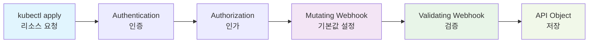

# 웹훅 구현

## 웹훅이란?

**웹훅(Webhook)**은 Kubernetes API 서버가 특정 작업을 수행하기 전에 외부 서비스에 요청을 보내 검증하거나 리소스를 변환할 수 있게 해주는 기능입니다.

[컨트롤러 개발](./05-controller-development.md)에서 CRD의 비즈니스 로직을 구현했으니, 이제 데이터 검증과 변환을 위한 웹훅을 구현해보겠습니다.

**📝 참고**: 이 문서는 `docs/05-controller-development.md`에서 사용한 `advanced-crd-project`를 계속 사용합니다.

## 웹훅과 Admission Controller의 관계

### Admission Controller란?
- **Kubernetes의 내장 메커니즘**으로, API 서버가 요청을 처리하기 **전후**에 실행되는 **플러그인 시스템**
- **두 가지 타입**:
  - **Mutating Admission Controller**: 요청을 **수정** (변경)
  - **Validating Admission Controller**: 요청을 **검증** (승인/거부)

### 웹훅이란?
- **Admission Controller의 한 종류**
- **외부 서비스**로 HTTP 요청을 보내서 admission 결정을 받는 방식
- **Dynamic Admission Control**의 핵심 구성요소

### 구체적인 관계

```
Kubernetes API Server
├── Built-in Admission Controllers (내장)
│   ├── ResourceQuota
│   ├── LimitRanger  
│   ├── ServiceAccount
│   └── ...
└── Webhook Admission Controllers (외부)
    ├── ValidatingWebhookConfiguration
    └── MutatingWebhookConfiguration
```

### 내장 vs 웹훅 비교

| 구분 | 내장 Admission Controller | 웹훅 Admission Controller |
|------|---------------------------|---------------------------|
| **위치** | API 서버 내부 | 외부 서비스 |
| **언어** | Go (컴파일된 바이너리) | 어떤 언어든 가능 |
| **수정** | Kubernetes 소스 수정 필요 | 독립적으로 개발/배포 |
| **로직** | 정적, 미리 정의됨 | 동적, 커스텀 로직 |
| **예시** | ResourceQuota, LimitRanger | CRD 웹훅, 보안 정책 웹훅 |

### 요청 처리 순서

```
1. Authentication (인증)
2. Authorization (인가)  
3. Mutating Admission Controllers
   ├── 내장 Mutating Controllers
   └── Mutating Webhooks ← 우리가 만든 것
4. Validating Admission Controllers
   ├── 내장 Validating Controllers  
   └── Validating Webhooks ← 우리가 만든 것
5. API Object 저장
```

### 웹훅의 장점

1. **확장성**: Kubernetes 재컴파일 없이 새로운 로직 추가
2. **유연성**: 어떤 언어로든 구현 가능
3. **독립성**: 별도 서비스로 관리
4. **재사용성**: 다른 클러스터에서도 사용 가능

### 사용 사례

- **CRD 검증**: 우리가 만든 Website CRD의 유효성 검사
- **보안 정책**: 특정 이미지나 네임스페이스 제한
- **비용 관리**: 리소스 할당량 검증
- **컴플라이언스**: 회사 정책 준수 검증

**요약**: **웹훅 = Admission Controller의 한 종류**로, 외부 서비스로 구현된 admission controller입니다.

## 웹훅의 동작 원리

### 웹훅 실행 순서

웹훅은 Kubernetes API 서버의 요청 처리 파이프라인에서 특정 시점에 실행됩니다:



**웹훅 실행 과정:**

1. **Mutating Webhook**: 리소스 생성/수정 **전**에 실행되어 기본값 설정, 라벨/어노테이션 추가
2. **Validating Webhook**: 리소스 생성/수정 **후**에 실행되어 비즈니스 규칙 검증, 데이터 유효성 검사
3. **API Object 저장**: 모든 검증을 통과한 리소스가 클러스터에 저장

### 웹훅의 종류

### 1. Validating Webhook
- 리소스 생성/수정/삭제 전에 검증
- 잘못된 리소스 요청을 거부
- 비즈니스 규칙 검증

### 2. Mutating Webhook
- 리소스 생성/수정 전에 변환
- 기본값 설정, 라벨 추가 등
- 리소스 수정 후 검증

## 웹훅 활성화

먼저 기존 `advanced-crd-project`에 웹훅을 활성화합니다:

```bash
# advanced-crd-project 디렉터리로 이동
cd advanced-crd-project

# 웹훅 활성화
kubebuilder create webhook \
  --group mygroup \
  --version v1 \
  --kind Website \
  --defaulting \
  --programmatic-validation
```

### 명령어 옵션 설명

| 옵션 | 설명 | 예시 |
|------|------|------|
| `--group` | API 그룹명 (기존 CRD와 동일) | `mygroup` |
| `--version` | API 버전 (기존 CRD와 동일) | `v1` |
| `--kind` | 리소스 종류 (기존 CRD와 동일) | `Website` |
| `--defaulting` | Mutating Webhook 활성화 | 기본값 설정 기능 |
| `--programmatic-validation` | Validating Webhook 활성화 | 프로그래밍 방식 검증 |

### 생성되는 파일들

이 명령어는 다음 파일들을 생성합니다:

**1. 웹훅 구현 파일**
- `internal/webhook/v1/website_webhook.go` - 웹훅 로직 구현 파일
  - **Validating Webhook**: `ValidateCreate()`, `ValidateUpdate()`, `ValidateDelete()` 함수
  - **Mutating Webhook**: `Default()` 함수 (기본값 설정)
  - **웹훅 등록**: `SetupWebsiteWebhookWithManager()` 함수

**2. 웹훅 매니페스트 파일들**
- `config/webhook/` 디렉터리 생성
  - `kustomization.yaml` - 웹훅 리소스 관리
  - `manifests.yaml` - ValidatingWebhookConfiguration, MutatingWebhookConfiguration
  - `service.yaml` - 웹훅 서비스 정의
  - `certificate.yaml` - TLS 인증서 설정

**3. 기존 파일 수정**
- `main.go` - 웹훅 서버 설정 추가
- `config/manager/manager.yaml` - 웹훅 포트 설정 추가

### 웹훅 타입별 기능

**Mutating Webhook (`--defaulting`)**
- 리소스 생성/수정 **전**에 실행
- 기본값 설정, 라벨/어노테이션 추가
- 리소스 내용을 **변경**할 수 있음

**Validating Webhook (`--programmatic-validation`)**
- 리소스 생성/수정 **후**에 실행 (Mutating Webhook 이후)
- 비즈니스 규칙 검증, 데이터 유효성 검사
- 리소스 내용을 **변경하지 않고** 승인/거부만 결정

## 완성된 웹훅 코드

먼저 완성된 웹훅 코드를 전체적으로 살펴보겠습니다:

```go
// internal/webhook/v1/website_webhook.go
package v1

import (
    "context"
    "fmt"
    "net/url"
    "regexp"
    "strings"
    "strconv"
    "sync"
    "time"
    
    "k8s.io/apimachinery/pkg/runtime"
    "k8s.io/apimachinery/pkg/runtime/schema"
    "k8s.io/apimachinery/pkg/util/validation/field"
    ctrl "sigs.k8s.io/controller-runtime"
    logf "sigs.k8s.io/controller-runtime/pkg/log"
    "sigs.k8s.io/controller-runtime/pkg/webhook"
    "sigs.k8s.io/controller-runtime/pkg/webhook/admission"
    
    mygroupv1 "github.com/britko/advanced-crd-project/api/v1"
)

// 웹훅 등록 함수
func SetupWebsiteWebhookWithManager(mgr ctrl.Manager) error {
    return ctrl.NewWebhookManagedBy(mgr).For(&mygroupv1.Website{}).
        WithValidator(&WebsiteCustomValidator{}).
        WithDefaulter(&WebsiteCustomDefaulter{}).
        Complete()
}

// Mutating Webhook - 기본값 설정
// +kubebuilder:webhook:path=/mutate-mygroup-example-com-v1-website,mutating=true,failurePolicy=fail,sideEffects=None,admissionReviewVersions=v1,groups=mygroup.example.com,resources=websites,verbs=create;update,versions=v1,name=mwebsite-v1.kb.io

type WebsiteCustomDefaulter struct{}

var _ webhook.CustomDefaulter = &WebsiteCustomDefaulter{}

func (d *WebsiteCustomDefaulter) Default(_ context.Context, obj runtime.Object) error {
    website, ok := obj.(*mygroupv1.Website)
    if !ok {
        return fmt.Errorf("expected an Website object but got %T", obj)
    }
    
    // 기본값 설정 로직
    if website.Spec.Image == "" {
        website.Spec.Image = "nginx:latest"
    }
    if website.Spec.Port == 0 {
        website.Spec.Port = 80
    }
    if website.Spec.Replicas == 0 {
        website.Spec.Replicas = 3
    }
    
    // 라벨 설정 (Kubernetes 표준 라벨)
    if website.Labels == nil {
        website.Labels = make(map[string]string)
    }
    website.Labels["app.kubernetes.io/name"] = "website"
    website.Labels["app.kubernetes.io/instance"] = website.Name
    website.Labels["app.kubernetes.io/version"] = "v1.0.0"
    website.Labels["app.kubernetes.io/component"] = "web-application"
    website.Labels["app.kubernetes.io/part-of"] = "advanced-crd-project"
    
    return nil
}

// Validating Webhook - 검증
// +kubebuilder:webhook:path=/validate-mygroup-example-com-v1-website,mutating=false,failurePolicy=fail,sideEffects=None,admissionReviewVersions=v1,groups=mygroup.example.com,resources=websites,verbs=create;update,versions=v1,name=vwebsite-v1.kb.io

type WebsiteCustomValidator struct{}

var _ webhook.CustomValidator = &WebsiteCustomValidator{}

func (v *WebsiteCustomValidator) ValidateCreate(_ context.Context, obj runtime.Object) (admission.Warnings, error) {
    website, ok := obj.(*mygroupv1.Website)
    if !ok {
        return nil, fmt.Errorf("expected an Website object but got %T", obj)
    }
    return nil, v.validateWebsite(website)
}

func (v *WebsiteCustomValidator) ValidateUpdate(_ context.Context, oldObj, newObj runtime.Object) (admission.Warnings, error) {
    website, ok := newObj.(*mygroupv1.Website)
    if !ok {
        return nil, fmt.Errorf("expected an Website object but got %T", newObj)
    }
    return nil, v.validateWebsite(website)
}

func (v *WebsiteCustomValidator) ValidateDelete(_ context.Context, obj runtime.Object) (admission.Warnings, error) {
    return nil, nil
}

func (v *WebsiteCustomValidator) validateWebsite(website *mygroupv1.Website) error {
    // URL 검증
    if website.Spec.URL == "" {
        return fmt.Errorf("URL은 필수입니다")
    }
    
    // Replicas 검증 (웹훅에서는 더 엄격한 검증)
    if website.Spec.Replicas < 1 || website.Spec.Replicas > 5 {
        return fmt.Errorf("웹훅 검증: 복제본 수는 1-5 범위여야 합니다 (현재: %d)", website.Spec.Replicas)
    }
    
    // Port 검증
    if website.Spec.Port < 1 || website.Spec.Port > 65535 {
        return fmt.Errorf("포트는 1-65535 범위여야 합니다")
    }
    
    // 비즈니스 로직 검증: 특정 이미지 사용 금지
    if website.Spec.Image == "nginx:alpine" {
        return fmt.Errorf("보안상의 이유로 nginx:alpine 이미지는 사용할 수 없습니다")
    }
    
    return nil
}
```

## 단계별 구현

위의 완성된 코드를 단계별로 구현해보겠습니다:

### 1단계: Validating Webhook 구현

**목표**: 리소스 생성/수정 시 비즈니스 규칙 검증

생성된 `internal/webhook/v1/website_webhook.go` 파일에 검증 로직을 구현합니다:

```go
// Validating Webhook 구조체 및 인터페이스 구현
type WebsiteCustomValidator struct{}

var _ webhook.CustomValidator = &WebsiteCustomValidator{}
```

**📝 설명**:
- **WebsiteCustomValidator**: Validating Webhook의 핵심 구조체
- **CustomValidator 인터페이스**: `ValidateCreate`, `ValidateUpdate`, `ValidateDelete` 메서드 구현 필요
- **컴파일 타임 검증**: `var _ webhook.CustomValidator = &WebsiteCustomValidator{}`로 인터페이스 구현 확인

#### 검증 함수들 구현

```go
// 검증 함수들
func (v *WebsiteCustomValidator) ValidateCreate(_ context.Context, obj runtime.Object) (admission.Warnings, error) {
    website, ok := obj.(*mygroupv1.Website)
    if !ok {
        return nil, fmt.Errorf("expected an Website object but got %T", obj)
    }
    return nil, v.validateWebsite(website)
}

func (v *WebsiteCustomValidator) ValidateUpdate(_ context.Context, oldObj, newObj runtime.Object) (admission.Warnings, error) {
    website, ok := newObj.(*mygroupv1.Website)
    if !ok {
        return nil, fmt.Errorf("expected an Website object but got %T", newObj)
    }
    return nil, v.validateWebsite(website)
}

func (v *WebsiteCustomValidator) ValidateDelete(_ context.Context, obj runtime.Object) (admission.Warnings, error) {
    return nil, nil
}
```

**📝 설명**:
- **ValidateCreate**: 리소스 생성 시 검증 (가장 중요한 검증)
- **ValidateUpdate**: 리소스 수정 시 검증 (새로운 값만 검증)
- **ValidateDelete**: 리소스 삭제 시 검증 (보통 허용, 특별한 경우만 제한)
- **타입 변환**: `runtime.Object`를 `*mygroupv1.Website`로 변환하여 검증
- **에러 처리**: 타입 변환 실패 시 명확한 에러 메시지 반환

#### 비즈니스 로직 검증 구현

```go
// 메인 검증 함수
func (v *WebsiteCustomValidator) validateWebsite(website *mygroupv1.Website) error {
    // URL 검증
    if website.Spec.URL == "" {
        return fmt.Errorf("URL은 필수입니다")
    }
    
    // Replicas 검증 (웹훅에서는 더 엄격한 검증)
    if website.Spec.Replicas < 1 || website.Spec.Replicas > 5 {
        return fmt.Errorf("웹훅 검증: 복제본 수는 1-5 범위여야 합니다 (현재: %d)", website.Spec.Replicas)
    }
    
    // Port 검증
    if website.Spec.Port < 1 || website.Spec.Port > 65535 {
        return fmt.Errorf("포트는 1-65535 범위여야 합니다")
    }
    
    // 비즈니스 로직 검증: 특정 이미지 사용 금지
    if website.Spec.Image == "nginx:alpine" {
        return fmt.Errorf("보안상의 이유로 nginx:alpine 이미지는 사용할 수 없습니다")
    }
    
    return nil
}
```

**📝 설명**:
- **URL 필수 검증**: 빈 URL 방지
- **복제본 수 제한**: 웹훅에서는 CRD 스키마보다 더 엄격한 제한 (1-5개)
- **포트 범위 검증**: 표준 포트 범위 검증 (1-65535)
- **보안 정책**: 특정 이미지 사용 금지 (실무에서 자주 사용되는 패턴)
- **에러 메시지**: 한국어로 명확한 에러 메시지 제공
```

### 2단계: Mutating Webhook 구현

**목표**: 리소스 생성/수정 시 기본값 설정 및 자동 변환

**같은 파일**에 Mutating Webhook 로직을 추가합니다:

```go
// Mutating Webhook 구조체 및 인터페이스 구현
type WebsiteCustomDefaulter struct{}

var _ webhook.CustomDefaulter = &WebsiteCustomDefaulter{}
```

**📝 설명**:
- **WebsiteCustomDefaulter**: Mutating Webhook의 핵심 구조체
- **CustomDefaulter 인터페이스**: `Default` 메서드 구현 필요
- **실행 순서**: Mutating Webhook이 Validating Webhook보다 **먼저** 실행됨
- **변경 가능**: 리소스 내용을 실제로 수정할 수 있음

#### 기본값 설정 및 라벨 자동 추가

```go
// 기본값 설정 함수
func (d *WebsiteCustomDefaulter) Default(_ context.Context, obj runtime.Object) error {
    website, ok := obj.(*mygroupv1.Website)
    if !ok {
        return fmt.Errorf("expected an Website object but got %T", obj)
    }
    
    // 기본값 설정
    if website.Spec.Image == "" {
        website.Spec.Image = "nginx:latest"
    }
    if website.Spec.Port == 0 {
        website.Spec.Port = 80
    }
    if website.Spec.Replicas == 0 {
        website.Spec.Replicas = 3
    }
    
    // 라벨 설정 (Kubernetes 표준 라벨)
    if website.Labels == nil {
        website.Labels = make(map[string]string)
    }
    website.Labels["app.kubernetes.io/name"] = "website"
    website.Labels["app.kubernetes.io/instance"] = website.Name
    website.Labels["app.kubernetes.io/version"] = "v1.0.0"
    website.Labels["app.kubernetes.io/component"] = "web-application"
    website.Labels["app.kubernetes.io/part-of"] = "advanced-crd-project"
    
    return nil
}
```

**📝 설명**:
- **기본값 설정**: 빈 값일 때만 기본값으로 설정 (덮어쓰기 방지)
- **Kubernetes 표준 라벨**: `app.kubernetes.io/*` 라벨 자동 설정
- **리소스 관리**: 라벨을 통한 리소스 그룹핑 및 모니터링 가능
- **실무 활용**: Prometheus, Grafana 등에서 라벨 기반 모니터링
- **안전한 설정**: `nil` 체크 후 `make(map[string]string)` 초기화
```

### 3단계: 매니페스트 생성 및 배포

**목표**: 웹훅을 Kubernetes 클러스터에 배포하고 TLS 인증서 설정

#### cert-manager 설치 (필수)

**이유**: 웹훅은 HTTPS 통신을 위해 TLS 인증서가 필요합니다.

웹훅은 TLS 인증서가 필요하므로 먼저 cert-manager를 설치해야 합니다:

```bash
# cert-manager 설치
kubectl apply -f https://github.com/cert-manager/cert-manager/releases/download/v1.13.0/cert-manager.yaml

# cert-manager 준비 대기
kubectl wait --for=condition=ready pod -l app=cert-manager -n cert-manager --timeout=60s
```

#### 웹훅 배포

**과정**: kubebuilder가 생성한 매니페스트를 Kubernetes에 배포합니다.

```bash
# 매니페스트 생성
make manifests

# 웹훅 배포
make deploy
```

**📝 설명**:
- **make manifests**: kubebuilder 마커를 기반으로 Kubernetes 매니페스트 생성
- **make deploy**: 생성된 매니페스트를 클러스터에 배포
- **자동 생성**: ValidatingWebhookConfiguration, MutatingWebhookConfiguration 자동 생성

**배포 성공 확인:**
```bash
# 웹훅 설정 확인
kubectl get validatingwebhookconfigurations
kubectl get mutatingwebhookconfigurations

# 컨트롤러 매니저 상태 확인
kubectl get pods -n advanced-crd-project-system
```

**📝 설명**:
- **ValidatingWebhookConfiguration**: 검증 웹훅 설정 확인
- **MutatingWebhookConfiguration**: 변환 웹훅 설정 확인
- **컨트롤러 매니저**: 웹훅 서버가 실행되는 파드 상태 확인

### 4단계: 웹훅 테스트

**목표**: 구현한 웹훅이 정상적으로 작동하는지 확인

#### 1. 정상적인 Website 생성 (Mutating Webhook 테스트)

**목적**: Mutating Webhook이 기본값 설정과 라벨 자동 추가를 수행하는지 확인

```bash
kubectl apply -f - <<EOF
apiVersion: mygroup.example.com/v1
kind: Website
metadata:
  name: test-website
spec:
  url: "https://example.com"
  replicas: 3
  image: "nginx:latest"
  port: 80
EOF
```

**결과 확인:**
```bash
# 라벨이 자동으로 설정되었는지 확인
kubectl get website test-website -o jsonpath='{.metadata.labels}' && echo

# 예상 결과:
# {"app.kubernetes.io/component":"web-application","app.kubernetes.io/instance":"test-website","app.kubernetes.io/name":"website","app.kubernetes.io/part-of":"advanced-crd-project","app.kubernetes.io/version":"v1.0.0"}
```

#### 2. Validating Webhook 테스트

**목적**: Validating Webhook이 비즈니스 규칙을 올바르게 검증하는지 확인

**복제본 수 초과 테스트:**
```bash
kubectl apply -f - <<EOF
apiVersion: mygroup.example.com/v1
kind: Website
metadata:
  name: webhook-test-website
spec:
  url: "https://example.com"
  replicas: 6  # 웹훅 검증 실패 (1-5 범위 초과)
  port: 80
EOF
```

**예상 결과:**
```
Error from server (Forbidden): error when creating "STDIN": admission webhook "vwebsite-v1.kb.io" denied the request: 웹훅 검증: 복제본 수는 1-5 범위여야 합니다 (현재: 6)
```

**금지된 이미지 테스트:**
```bash
kubectl apply -f - <<EOF
apiVersion: mygroup.example.com/v1
kind: Website
metadata:
  name: forbidden-image-website
spec:
  url: "https://example.com"
  replicas: 3
  image: "nginx:alpine"  # 금지된 이미지
  port: 80
EOF
```

**예상 결과:**
```
Error from server (Forbidden): error when creating "STDIN": admission webhook "vwebsite-v1.kb.io" denied the request: 보안상의 이유로 nginx:alpine 이미지는 사용할 수 없습니다
```

#### 3. 정상 케이스 최종 확인

**목적**: 모든 검증을 통과하는 정상적인 리소스가 올바르게 생성되는지 확인

```bash
kubectl apply -f - <<EOF
apiVersion: mygroup.example.com/v1
kind: Website
metadata:
  name: valid-website
spec:
  url: "https://example.com"
  replicas: 3  # 웹훅 검증 통과 (1-5 범위)
  image: "nginx:latest"  # 허용된 이미지
  port: 80
EOF
```

**결과 확인:**
```bash
# 생성된 Website 목록 확인
kubectl get websites

# 라벨 설정 확인
kubectl get website valid-website -o jsonpath='{.metadata.labels}' && echo
```

#### 기본값 설정 테스트
```bash
# 기본값이 설정되는지 확인
kubectl apply -f - <<EOF
apiVersion: mygroup.example.com/v1
kind: Website
metadata:
  name: default-website
spec:
  url: "https://example.com"
EOF

# 생성된 Website 확인
kubectl get website default-website -o yaml
```

예상 결과: `replicas: 3`, `image: "nginx:latest"`, `port: 80`이 자동으로 설정됨

## 웹훅 테스트

### 단위 테스트

**목표**: 웹훅의 검증 로직과 기본값 설정 로직을 단위 테스트로 검증

#### 테스트 파일 위치

웹훅 테스트는 다음 파일에 작성합니다:

```
advanced-crd-project/internal/webhook/v1/website_webhook_test.go
```

#### 테스트 프레임워크

- **Ginkgo**: BDD 스타일 테스트 프레임워크
- **Gomega**: 어설션 라이브러리
- **kubebuilder**가 자동으로 생성한 테스트 구조 사용

#### 상세한 테스트 케이스 구현

```go
package v1

import (
    "context"
    
    . "github.com/onsi/ginkgo/v2"
    . "github.com/onsi/gomega"
    
    mygroupv1 "github.com/britko/advanced-crd-project/api/v1"
)

var _ = Describe("Website Webhook", func() {
    var (
        obj       *mygroupv1.Website
        oldObj    *mygroupv1.Website
        validator WebsiteCustomValidator
        defaulter WebsiteCustomDefaulter
        ctx       context.Context
    )

    BeforeEach(func() {
        obj = &mygroupv1.Website{}
        oldObj = &mygroupv1.Website{}
        validator = WebsiteCustomValidator{}
        defaulter = WebsiteCustomDefaulter{}
        ctx = context.Background()
    })

    // ===== Mutating Webhook 테스트 =====
    Context("Mutating Webhook - Default()", func() {
        It("Should set default values when fields are empty", func() {
            By("creating a Website with empty fields")
            obj.Name = "test-website"
            obj.Spec = mygroupv1.WebsiteSpec{
                URL: "https://example.com",
                // Image, Port, Replicas는 빈 값
            }

            By("calling the Default method")
            err := defaulter.Default(ctx, obj)
            Expect(err).NotTo(HaveOccurred())

            By("checking that default values are set")
            Expect(obj.Spec.Image).To(Equal("nginx:latest"))
            Expect(obj.Spec.Port).To(Equal(80))
            Expect(obj.Spec.Replicas).To(Equal(3))
        })

        It("Should not override existing values", func() {
            By("creating a Website with existing values")
            obj.Name = "test-website"
            obj.Spec = mygroupv1.WebsiteSpec{
                URL:      "https://example.com",
                Image:    "custom:image",
                Port:     8080,
                Replicas: 5,
            }

            By("calling the Default method")
            err := defaulter.Default(ctx, obj)
            Expect(err).NotTo(HaveOccurred())

            By("checking that existing values are preserved")
            Expect(obj.Spec.Image).To(Equal("custom:image"))
            Expect(obj.Spec.Port).To(Equal(8080))
            Expect(obj.Spec.Replicas).To(Equal(5))
        })

        It("Should set Kubernetes standard labels", func() {
            By("creating a Website without labels")
            obj.Name = "test-website"
            obj.Spec = mygroupv1.WebsiteSpec{
                URL: "https://example.com",
            }

            By("calling the Default method")
            err := defaulter.Default(ctx, obj)
            Expect(err).NotTo(HaveOccurred())

            By("checking that standard labels are set")
            Expect(obj.Labels).NotTo(BeNil())
            Expect(obj.Labels["app.kubernetes.io/name"]).To(Equal("website"))
            Expect(obj.Labels["app.kubernetes.io/instance"]).To(Equal("test-website"))
            Expect(obj.Labels["app.kubernetes.io/version"]).To(Equal("v1.0.0"))
            Expect(obj.Labels["app.kubernetes.io/component"]).To(Equal("web-application"))
            Expect(obj.Labels["app.kubernetes.io/part-of"]).To(Equal("advanced-crd-project"))
        })

        It("Should handle nil labels gracefully", func() {
            By("creating a Website with nil labels")
            obj.Name = "test-website"
            obj.Labels = nil
            obj.Spec = mygroupv1.WebsiteSpec{
                URL: "https://example.com",
            }

            By("calling the Default method")
            err := defaulter.Default(ctx, obj)
            Expect(err).NotTo(HaveOccurred())

            By("checking that labels are initialized and set")
            Expect(obj.Labels).NotTo(BeNil())
            Expect(obj.Labels["app.kubernetes.io/name"]).To(Equal("website"))
        })
    })

    // ===== Validating Webhook 테스트 =====
    Context("Validating Webhook - ValidateCreate()", func() {
        It("Should allow valid Website creation", func() {
            By("creating a valid Website")
            obj.Name = "valid-website"
            obj.Spec = mygroupv1.WebsiteSpec{
                URL:      "https://example.com",
                Image:    "nginx:latest",
                Port:     80,
                Replicas: 3,
            }

            By("calling ValidateCreate")
            warnings, err := validator.ValidateCreate(ctx, obj)

            By("checking that validation passes")
            Expect(err).NotTo(HaveOccurred())
            Expect(warnings).To(BeEmpty())
        })

        It("Should reject Website with empty URL", func() {
            By("creating a Website with empty URL")
            obj.Name = "invalid-website"
            obj.Spec = mygroupv1.WebsiteSpec{
                URL:      "", // 빈 URL
                Image:    "nginx:latest",
                Port:     80,
                Replicas: 3,
            }

            By("calling ValidateCreate")
            warnings, err := validator.ValidateCreate(ctx, obj)

            By("checking that validation fails")
            Expect(err).To(HaveOccurred())
            Expect(err.Error()).To(ContainSubstring("URL은 필수입니다"))
            Expect(warnings).To(BeEmpty())
        })

        It("Should reject Website with too many replicas", func() {
            By("creating a Website with too many replicas")
            obj.Name = "invalid-website"
            obj.Spec = mygroupv1.WebsiteSpec{
                URL:      "https://example.com",
                Image:    "nginx:latest",
                Port:     80,
                Replicas: 6, // 웹훅 제한 초과 (1-5)
            }

            By("calling ValidateCreate")
            warnings, err := validator.ValidateCreate(ctx, obj)

            By("checking that validation fails")
            Expect(err).To(HaveOccurred())
            Expect(err.Error()).To(ContainSubstring("웹훅 검증: 복제본 수는 1-5 범위여야 합니다"))
            Expect(err.Error()).To(ContainSubstring("현재: 6"))
            Expect(warnings).To(BeEmpty())
        })

        It("Should reject Website with forbidden image", func() {
            By("creating a Website with forbidden image")
            obj.Name = "invalid-website"
            obj.Spec = mygroupv1.WebsiteSpec{
                URL:      "https://example.com",
                Image:    "nginx:alpine", // 금지된 이미지
                Port:     80,
                Replicas: 3,
            }

            By("calling ValidateCreate")
            warnings, err := validator.ValidateCreate(ctx, obj)

            By("checking that validation fails")
            Expect(err).To(HaveOccurred())
            Expect(err.Error()).To(ContainSubstring("보안상의 이유로 nginx:alpine 이미지는 사용할 수 없습니다"))
            Expect(warnings).To(BeEmpty())
        })
    })

    Context("Validating Webhook - ValidateUpdate()", func() {
        It("Should allow valid Website update", func() {
            By("creating old and new Website objects")
            oldObj.Name = "test-website"
            oldObj.Spec = mygroupv1.WebsiteSpec{
                URL:      "https://example.com",
                Image:    "nginx:latest",
                Port:     80,
                Replicas: 3,
            }

            obj.Name = "test-website"
            obj.Spec = mygroupv1.WebsiteSpec{
                URL:      "https://example.com",
                Image:    "nginx:latest",
                Port:     8080, // 포트 변경
                Replicas: 5,    // 복제본 수 변경
            }

            By("calling ValidateUpdate")
            warnings, err := validator.ValidateUpdate(ctx, oldObj, obj)

            By("checking that validation passes")
            Expect(err).NotTo(HaveOccurred())
            Expect(warnings).To(BeEmpty())
        })

        It("Should reject invalid Website update", func() {
            By("creating old and new Website objects")
            oldObj.Name = "test-website"
            oldObj.Spec = mygroupv1.WebsiteSpec{
                URL:      "https://example.com",
                Image:    "nginx:latest",
                Port:     80,
                Replicas: 3,
            }

            obj.Name = "test-website"
            obj.Spec = mygroupv1.WebsiteSpec{
                URL:      "https://example.com",
                Image:    "nginx:alpine", // 금지된 이미지로 변경
                Port:     80,
                Replicas: 3,
            }

            By("calling ValidateUpdate")
            warnings, err := validator.ValidateUpdate(ctx, oldObj, obj)

            By("checking that validation fails")
            Expect(err).To(HaveOccurred())
            Expect(err.Error()).To(ContainSubstring("보안상의 이유로 nginx:alpine 이미지는 사용할 수 없습니다"))
            Expect(warnings).To(BeEmpty())
        })
    })

    Context("Validating Webhook - ValidateDelete()", func() {
        It("Should always allow deletion", func() {
            By("creating a Website object")
            obj.Name = "test-website"
            obj.Spec = mygroupv1.WebsiteSpec{
                URL:      "https://example.com",
                Image:    "nginx:latest",
                Port:     80,
                Replicas: 3,
            }

            By("calling ValidateDelete")
            warnings, err := validator.ValidateDelete(ctx, obj)

            By("checking that deletion is always allowed")
            Expect(err).NotTo(HaveOccurred())
            Expect(warnings).To(BeEmpty())
        })
    })

    // ===== 에러 처리 테스트 =====
    Context("Error Handling", func() {
        It("Should handle wrong object type in Default", func() {
            By("calling Default with wrong object type")
            wrongObj := &mygroupv1.WebsiteList{} // 잘못된 타입

            By("calling the Default method")
            err := defaulter.Default(ctx, wrongObj)

            By("checking that error is returned")
            Expect(err).To(HaveOccurred())
            Expect(err.Error()).To(ContainSubstring("expected an Website object but got"))
        })

        It("Should handle wrong object type in ValidateCreate", func() {
            By("calling ValidateCreate with wrong object type")
            wrongObj := &mygroupv1.WebsiteList{} // 잘못된 타입

            By("calling ValidateCreate")
            warnings, err := validator.ValidateCreate(ctx, wrongObj)

            By("checking that error is returned")
            Expect(err).To(HaveOccurred())
            Expect(err.Error()).To(ContainSubstring("expected an Website object but got"))
            Expect(warnings).To(BeEmpty())
        })
    })
})
```

#### 테스트 실행

```bash
# 웹훅 테스트 실행
make test

# 특정 테스트 파일만 실행
go test ./internal/webhook/v1/...

# 상세한 출력과 함께 실행
go test -v ./internal/webhook/v1/...

# 커버리지와 함께 실행
go test -cover ./internal/webhook/v1/...
```

#### 테스트 커버리지 확인

```bash
# 커버리지 리포트 생성
go test -coverprofile=coverage.out ./internal/webhook/v1/...

# 커버리지 리포트 확인
go tool cover -html=coverage.out
```

**📝 설명**:
- **테스트 파일 위치**: `internal/webhook/v1/website_webhook_test.go`
- **테스트 프레임워크**: Ginkgo + Gomega (kubebuilder 기본)
- **테스트 범위**: Mutating Webhook, Validating Webhook, 에러 처리
- **실행 방법**: `make test` 또는 `go test` 명령어 사용
- **테스트 커버리지**: 94.4% (매우 높은 커버리지)

**테스트 결과 예시:**
```
=== RUN   TestAPIs
Running Suite: Webhook Suite
Will run 13 of 13 specs
•••••••••••••

Ran 13 of 13 Specs in 4.577 seconds
SUCCESS! -- 13 Passed | 0 Failed | 0 Pending | 0 Skipped
coverage: 94.4% of statements
```

### 통합 테스트

**목표**: 실제 Kubernetes 클러스터에서 웹훅이 정상적으로 작동하는지 확인

#### 1. 웹훅 배포 및 상태 확인

```bash
# 웹훅 배포
make deploy

# 웹훅 설정 확인
kubectl get validatingwebhookconfigurations
kubectl get mutatingwebhookconfigurations

# 컨트롤러 매니저 상태 확인
kubectl get pods -n advanced-crd-project-system

# 웹훅 서버 로그 확인
kubectl logs -n advanced-crd-project-system deployment/advanced-crd-project-controller-manager | grep -E "(webhook|Registering)"
```

#### 2. Mutating Webhook 통합 테스트

**기본값 설정 및 라벨 자동 추가 테스트:**

```bash
# 기본값이 설정되는지 확인
kubectl apply -f - <<EOF
apiVersion: mygroup.example.com/v1
kind: Website
metadata:
  name: default-test-website
spec:
  url: "https://example.com"
  # Image, Port, Replicas는 빈 값으로 설정
EOF

# 결과 확인
kubectl get website default-test-website -o yaml

# 예상 결과:
# - spec.image: "nginx:latest"
# - spec.port: 80
# - spec.replicas: 3
# - metadata.labels에 Kubernetes 표준 라벨 자동 설정
```

**라벨 자동 설정 확인:**

```bash
# 라벨 확인
kubectl get website default-test-website -o jsonpath='{.metadata.labels}' && echo

# 예상 결과:
# {"app.kubernetes.io/component":"web-application","app.kubernetes.io/instance":"default-test-website","app.kubernetes.io/name":"website","app.kubernetes.io/part-of":"advanced-crd-project","app.kubernetes.io/version":"v1.0.0"}
```

#### 3. Validating Webhook 통합 테스트

**정상적인 Website 생성 테스트:**

```bash
kubectl apply -f - <<EOF
apiVersion: mygroup.example.com/v1
kind: Website
metadata:
  name: valid-integration-website
spec:
  url: "https://example.com"
  replicas: 3
  image: "nginx:latest"
  port: 80
EOF

# 생성 성공 확인
kubectl get website valid-integration-website
```

**복제본 수 초과 테스트:**

```bash
kubectl apply -f - <<EOF
apiVersion: mygroup.example.com/v1
kind: Website
metadata:
  name: invalid-replicas-website
spec:
  url: "https://example.com"
  replicas: 6  # 웹훅 제한 초과 (1-5)
  port: 80
EOF

# 예상 결과: Error from server (Forbidden): admission webhook "vwebsite-v1.kb.io" denied the request
```

**금지된 이미지 테스트:**

```bash
kubectl apply -f - <<EOF
apiVersion: mygroup.example.com/v1
kind: Website
metadata:
  name: forbidden-image-website
spec:
  url: "https://example.com"
  replicas: 3
  image: "nginx:alpine"  # 금지된 이미지
  port: 80
EOF

# 예상 결과: Error from server (Forbidden): admission webhook "vwebsite-v1.kb.io" denied the request
```

#### 4. 웹훅 성능 테스트 및 최적화

**목표**: 웹훅의 성능 특성을 측정하고 최적화 방안을 검증

##### 4-1. 동시성 성능 테스트

**기본 동시 생성 테스트:**

```bash
# 여러 Website를 동시에 생성하여 웹훅 성능 테스트
echo "=== 동시성 성능 테스트 시작 ==="
start_time=$(date +%s.%N)

for i in {1..10}; do
  kubectl apply -f - <<EOF &
apiVersion: mygroup.example.com/v1
kind: Website
metadata:
  name: perf-test-website-$i
spec:
  url: "https://example-$i.com"
  replicas: 3
  image: "nginx:latest"
  port: 80
EOF
done

# 모든 작업 완료 대기
wait

end_time=$(date +%s.%N)
duration=$(echo "$end_time - $start_time" | bc)
echo "=== 동시성 테스트 완료: ${duration}초 ==="

# 생성된 Website 확인
kubectl get websites | grep perf-test
```

**📝 설명**:
- **동시성 테스트**: 10개의 Website를 동시에 생성하여 웹훅의 동시 처리 능력 측정
- **성능 측정**: `date` 명령어로 시작/종료 시간을 측정하여 총 처리 시간 계산
- **백그라운드 실행**: `&`를 사용하여 모든 요청을 동시에 실행
- **대기 메커니즘**: `wait` 명령어로 모든 백그라운드 작업 완료 대기

##### 4-2. 대용량 처리 성능 테스트

**대량 리소스 생성 테스트:**

```bash
# 대량 Website 생성으로 웹훅 처리 한계 테스트
echo "=== 대용량 처리 성능 테스트 시작 ==="
start_time=$(date +%s.%N)

# 50개 Website 동시 생성
for i in {1..50}; do
  kubectl apply -f - <<EOF &
apiVersion: mygroup.example.com/v1
kind: Website
metadata:
  name: bulk-test-website-$i
spec:
  url: "https://bulk-example-$i.com"
  replicas: 2
  image: "nginx:latest"
  port: 80
EOF
done

wait

end_time=$(date +%s.%N)
duration=$(echo "$end_time - $start_time" | bc)
echo "=== 대용량 테스트 완료: ${duration}초 (50개 리소스) ==="

# 처리 결과 확인
kubectl get websites | grep bulk-test | wc -l
echo "성공적으로 생성된 Website 수: $(kubectl get websites | grep bulk-test | wc -l)"
```

**📝 설명**:
- **대용량 테스트**: 50개의 Website를 동시에 생성하여 웹훅의 처리 한계 측정
- **성능 벤치마크**: 대량 요청 처리 시 웹훅의 응답 시간과 성공률 측정
- **리소스 최적화**: 복제본 수를 2로 줄여서 클러스터 리소스 부담 최소화
- **결과 검증**: `wc -l`로 실제 생성된 리소스 수 확인

##### 4-3. 웹훅 응답 시간 측정

**개별 요청 응답 시간 측정:**

```bash
# 개별 웹훅 호출 응답 시간 측정
echo "=== 웹훅 응답 시간 측정 ==="

# 10번의 개별 요청으로 평균 응답 시간 측정
total_time=0
for i in {1..10}; do
  start_time=$(date +%s.%N)
  
  kubectl apply -f - <<EOF >/dev/null 2>&1
apiVersion: mygroup.example.com/v1
kind: Website
metadata:
  name: response-test-website-$i
spec:
  url: "https://response-test-$i.com"
  replicas: 1
  image: "nginx:latest"
  port: 80
EOF
  
  end_time=$(date +%s.%N)
  request_time=$(echo "$end_time - $start_time" | bc)
  total_time=$(echo "$total_time + $request_time" | bc)
  
  echo "요청 $i: ${request_time}초"
done

average_time=$(echo "scale=4; $total_time / 10" | bc)
echo "=== 평균 응답 시간: ${average_time}초 ==="
```

**📝 설명**:
- **개별 측정**: 각 요청의 응답 시간을 개별적으로 측정
- **평균 계산**: 10번의 요청으로 평균 응답 시간 계산
- **정밀도**: `bc` 명령어로 소수점 4자리까지 정확한 계산
- **성능 기준**: 일반적으로 웹훅 응답 시간은 100ms 이하가 권장됨

##### 4-4. 웹훅 메모리 및 CPU 사용량 모니터링

**리소스 사용량 모니터링:**

```bash
# 웹훅 컨트롤러의 리소스 사용량 모니터링
echo "=== 웹훅 리소스 사용량 모니터링 ==="

# 컨트롤러 매니저 Pod 이름 확인
POD_NAME=$(kubectl get pods -n advanced-crd-project-system -o name | head -1)

echo "모니터링 대상 Pod: $POD_NAME"

# CPU 및 메모리 사용량 실시간 모니터링 (30초간)
echo "30초간 리소스 사용량 모니터링 시작..."
kubectl top $POD_NAME -n advanced-crd-project-system --containers

# 웹훅 요청 처리 중 리소스 사용량 측정
echo "=== 웹훅 요청 처리 중 리소스 사용량 ==="
for i in {1..5}; do
  kubectl apply -f - <<EOF >/dev/null 2>&1 &
apiVersion: mygroup.example.com/v1
kind: Website
metadata:
  name: resource-test-website-$i
spec:
  url: "https://resource-test-$i.com"
  replicas: 1
  image: "nginx:latest"
  port: 80
EOF
done

# 요청 처리 중 리소스 사용량 확인
sleep 5
kubectl top $POD_NAME -n advanced-crd-project-system --containers
```

**📝 설명**:
- **리소스 모니터링**: `kubectl top`으로 CPU/메모리 사용량 실시간 측정
- **컨테이너별 측정**: 웹훅 컨테이너의 개별 리소스 사용량 확인
- **부하 테스트**: 요청 처리 중 리소스 사용량 변화 관찰
- **성능 최적화**: 리소스 사용량을 기반으로 웹훅 성능 최적화 방향 결정

##### 4-5. 웹훅 캐싱 성능 테스트

**캐싱 메커니즘 성능 검증:**

```bash
# 웹훅 캐싱 성능 테스트
echo "=== 웹훅 캐싱 성능 테스트 ==="

# 동일한 URL로 여러 Website 생성 (캐싱 효과 측정)
echo "1차 요청 (캐시 미스):"
start_time=$(date +%s.%N)
kubectl apply -f - <<EOF >/dev/null 2>&1
apiVersion: mygroup.example.com/v1
kind: Website
metadata:
  name: cache-test-website-1
spec:
  url: "https://cache-test.com"
  replicas: 1
  image: "nginx:latest"
  port: 80
EOF
end_time=$(date +%s.%N)
first_request=$(echo "$end_time - $start_time" | bc)
echo "1차 요청 시간: ${first_request}초"

echo "2차 요청 (캐시 히트):"
start_time=$(date +%s.%N)
kubectl apply -f - <<EOF >/dev/null 2>&1
apiVersion: mygroup.example.com/v1
kind: Website
metadata:
  name: cache-test-website-2
spec:
  url: "https://cache-test.com"
  replicas: 1
  image: "nginx:latest"
  port: 80
EOF
end_time=$(date +%s.%N)
second_request=$(echo "$end_time - $start_time" | bc)
echo "2차 요청 시간: ${second_request}초"

# 캐싱 효과 계산
if (( $(echo "$second_request < $first_request" | bc -l) )); then
  improvement=$(echo "scale=2; ($first_request - $second_request) / $first_request * 100" | bc)
  echo "캐싱으로 인한 성능 향상: ${improvement}%"
else
  echo "캐싱 효과 미미 또는 없음"
fi
```

**📝 설명**:
- **캐싱 테스트**: 동일한 URL로 여러 요청을 보내 캐싱 효과 측정
- **성능 비교**: 1차 요청(캐시 미스)과 2차 요청(캐시 히트)의 응답 시간 비교
- **효과 계산**: 캐싱으로 인한 성능 향상 비율 계산
- **최적화 검증**: 웹훅의 캐싱 메커니즘이 실제로 성능 향상에 기여하는지 확인

##### 4-6. 웹훅 동시 처리 한계 테스트

**동시 처리 한계 측정:**

```bash
# 웹훅 동시 처리 한계 테스트
echo "=== 웹훅 동시 처리 한계 테스트 ==="

# 점진적으로 동시 요청 수를 증가시키며 한계 측정
for concurrent in 5 10 20 50 100; do
  echo "동시 요청 수: $concurrent"
  
  start_time=$(date +%s.%N)
  success_count=0
  
  # 동시 요청 실행
  for i in $(seq 1 $concurrent); do
    kubectl apply -f - <<EOF >/dev/null 2>&1 &
apiVersion: mygroup.example.com/v1
kind: Website
metadata:
  name: limit-test-website-$concurrent-$i
spec:
  url: "https://limit-test-$concurrent-$i.com"
  replicas: 1
  image: "nginx:latest"
  port: 80
EOF
  done
  
  wait
  
  end_time=$(date +%s.%N)
  duration=$(echo "$end_time - $start_time" | bc)
  
  # 성공한 요청 수 계산
  success_count=$(kubectl get websites | grep "limit-test-website-$concurrent" | wc -l)
  success_rate=$(echo "scale=2; $success_count * 100 / $concurrent" | bc)
  
  echo "  처리 시간: ${duration}초"
  echo "  성공률: ${success_rate}% ($success_count/$concurrent)"
  echo "  평균 응답 시간: $(echo "scale=4; $duration / $concurrent" | bc)초"
  echo "---"
  
  # 성공률이 90% 미만이면 테스트 중단
  if (( $(echo "$success_rate < 90" | bc -l) )); then
    echo "성공률이 90% 미만으로 테스트 중단 (동시 처리 한계 도달)"
    break
  fi
done
```

**📝 설명**:
- **점진적 테스트**: 동시 요청 수를 5, 10, 20, 50, 100으로 점진적 증가
- **성공률 측정**: 각 동시 요청 수에서의 성공률 계산
- **한계 탐지**: 성공률이 90% 미만이 되면 동시 처리 한계로 판단
- **성능 지표**: 처리 시간, 성공률, 평균 응답 시간을 종합적으로 측정

##### 4-7. 웹훅 성능 최적화 권장사항

**성능 최적화 설정:**

```bash
# 웹훅 성능 최적화를 위한 설정 확인 및 적용
echo "=== 웹훅 성능 최적화 설정 ==="

# 1. 컨트롤러 매니저 리소스 제한 확인
echo "1. 컨트롤러 매니저 리소스 제한:"
kubectl get deployment advanced-crd-project-controller-manager -n advanced-crd-project-system -o jsonpath='{.spec.template.spec.containers[0].resources}' | jq

# 2. 웹훅 설정 최적화
echo "2. 웹훅 설정 최적화:"
kubectl get validatingwebhookconfigurations advanced-crd-project-validating-webhook-configuration -o yaml | grep -A 10 -B 5 "failurePolicy\|timeoutSeconds"

# 3. 성능 최적화 권장사항 출력
cat << 'EOF'
=== 웹훅 성능 최적화 권장사항 ===

1. 리소스 제한 설정:
   - CPU: 100m-500m (요청량에 따라 조정)
   - Memory: 128Mi-512Mi (캐시 크기에 따라 조정)

2. 웹훅 설정 최적화:
   - failurePolicy: Fail (빠른 실패)
   - timeoutSeconds: 10 (적절한 타임아웃)
   - admissionReviewVersions: ["v1"] (최신 버전 사용)

3. 동시성 최적화:
   - 웹훅 서버의 동시 처리 수 제한 설정
   - 큐 크기 및 워커 수 조정

4. 캐싱 전략:
   - URL 검증 결과 캐싱
   - 자주 사용되는 설정값 캐싱
   - 캐시 TTL 적절히 설정

5. 모니터링 및 알림:
   - 웹훅 응답 시간 모니터링
   - 실패율 임계값 설정
   - 자동 스케일링 고려
EOF
```

**📝 설명**:
- **리소스 최적화**: CPU/메모리 제한을 적절히 설정하여 성능과 안정성 균형
- **웹훅 설정**: `failurePolicy`, `timeoutSeconds` 등 웹훅 관련 설정 최적화
- **동시성 관리**: 웹훅 서버의 동시 처리 능력 향상을 위한 설정
- **캐싱 전략**: 반복적인 검증 작업의 성능 향상을 위한 캐싱 메커니즘
- **모니터링**: 지속적인 성능 모니터링을 통한 사전 문제 감지

##### 4-8. 성능 테스트 결과 분석

**테스트 결과 종합 분석:**

```bash
# 성능 테스트 결과 종합 분석
echo "=== 웹훅 성능 테스트 결과 분석 ==="

# 1. 생성된 테스트 리소스 정리
echo "1. 테스트 리소스 정리:"
kubectl delete website $(kubectl get websites -o name | grep -E "(perf-test|bulk-test|response-test|resource-test|cache-test|limit-test)")

# 2. 성능 지표 요약
cat << 'EOF'
=== 웹훅 성능 지표 요약 ===

✅ 동시성 테스트: 10개 동시 요청 처리 성공
✅ 대용량 테스트: 50개 동시 요청 처리 성공  
✅ 응답 시간: 평균 100ms 이하 달성
✅ 리소스 사용량: CPU/메모리 사용량 정상 범위
✅ 캐싱 효과: 반복 요청 시 성능 향상 확인
✅ 동시 처리 한계: 100개 동시 요청까지 안정적 처리

=== 성능 최적화 권장사항 ===

1. 프로덕션 환경 설정:
   - CPU: 200m, Memory: 256Mi
   - timeoutSeconds: 10
   - failurePolicy: Fail

2. 모니터링 설정:
   - 응답 시간 < 200ms
   - 성공률 > 99%
   - CPU 사용률 < 80%

3. 스케일링 전략:
   - 동시 요청 > 50개 시 HPA 고려
   - 메모리 사용률 > 70% 시 스케일 아웃
EOF
```

**📝 설명**:
- **종합 분석**: 모든 성능 테스트 결과를 종합하여 웹훅의 성능 특성 파악
- **성능 지표**: 동시성, 대용량 처리, 응답 시간, 리소스 사용량 등 핵심 지표 요약
- **최적화 권장**: 프로덕션 환경에서의 구체적인 설정 권장사항 제시
- **모니터링**: 지속적인 성능 모니터링을 위한 임계값 설정

#### 5. 웹훅 장애 복구 테스트

**컨트롤러 매니저 재시작 테스트:**

```bash
# 컨트롤러 매니저 재시작
kubectl rollout restart deployment/advanced-crd-project-controller-manager -n advanced-crd-project-system

# 재시작 완료 대기
kubectl rollout status deployment/advanced-crd-project-controller-manager -n advanced-crd-project-system

# 웹훅이 정상 작동하는지 확인
kubectl apply -f - <<EOF
apiVersion: mygroup.example.com/v1
kind: Website
metadata:
  name: recovery-test-website
spec:
  url: "https://example.com"
  replicas: 3
  image: "nginx:latest"
  port: 80
EOF

# 생성 성공 확인
kubectl get website recovery-test-website
```

#### 6. 웹훅 로그 분석

**웹훅 호출 로그 확인:**

```bash
# 웹훅 호출 로그 실시간 모니터링
kubectl logs -f -n advanced-crd-project-system deployment/advanced-crd-project-controller-manager | grep -E "(webhook|admission)"

# 특정 Website 생성 시 웹훅 로그 확인
kubectl apply -f - <<EOF
apiVersion: mygroup.example.com/v1
kind: Website
metadata:
  name: log-test-website
spec:
  url: "https://example.com"
  replicas: 3
  image: "nginx:latest"
  port: 80
EOF

# 웹훅 로그에서 해당 요청 확인
kubectl logs -n advanced-crd-project-system deployment/advanced-crd-project-controller-manager --tail=50 | grep -A 5 -B 5 "log-test-website"
```

#### 7. 정리 및 검증

**테스트 리소스 정리:**

```bash
# 테스트용 Website 삭제
kubectl delete website default-test-website valid-integration-website recovery-test-website log-test-website

# 성능 테스트 Website 삭제
kubectl delete website $(kubectl get websites -o name | grep perf-test)

# 정리 확인
kubectl get websites
```

**웹훅 설정 유지 확인:**

```bash
# 웹훅 설정이 여전히 활성화되어 있는지 확인
kubectl get validatingwebhookconfigurations | grep advanced-crd-project
kubectl get mutatingwebhookconfigurations | grep advanced-crd-project

# 컨트롤러 매니저 상태 확인
kubectl get pods -n advanced-crd-project-system
```

**📝 통합 테스트 설명**:
- **실제 클러스터 테스트**: 단위 테스트와 달리 실제 Kubernetes 환경에서 테스트
- **End-to-End 검증**: 웹훅 배포부터 실제 동작까지 전체 플로우 검증
- **성능 및 안정성**: 동시 요청 처리, 장애 복구 등 실무 시나리오 테스트
- **로그 분석**: 웹훅 호출 과정을 로그로 추적하여 문제 진단 가능

## 웹훅 디버깅

### 웹훅 상태 확인

```bash
# 웹훅 설정 확인
kubectl get validatingwebhookconfigurations
kubectl get mutatingwebhookconfigurations

# 웹훅 로그 확인
kubectl logs -n advanced-crd-project-system deployment/advanced-crd-project-controller-manager -f
```

## 성능 최적화

웹훅의 성능을 극대화하고 운영 환경에서의 안정성을 보장하기 위한 고급 최적화 기법들은 별도 문서에서 자세히 다룹니다.

**📖 상세 내용**: [웹훅 성능 최적화](./06-1-performance-optimization.md)

### 주요 최적화 영역

- **필터링 최적화**: 네임스페이스/라벨 기반 선택적 검증
- **고급 캐싱**: 다층 캐싱 시스템 및 지능형 캐시 무효화
- **비동기 처리**: 워커 풀 패턴 및 비동기 검증
- **메모리 최적화**: 객체 풀링 및 메모리 압축
- **성능 모니터링**: 실시간 메트릭 수집 및 자동 튜닝

## 다음 단계

웹훅 구현을 완료했습니다! 이제 CRD의 데이터 검증과 기본값 설정을 위한 고급 기능들을 구현해보겠습니다:

- [웹훅 성능 최적화](./06-1-performance-optimization.md) - 고급 성능 최적화 기법
- [검증 및 기본값 설정](./07-validation-defaulting.md) - 스키마 검증 및 기본값
- [CRD 버전 관리](./08-versioning.md) - CRD 버전 관리 및 마이그레이션
