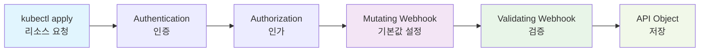

# 웹훅 구현

## 웹훅이란?

**웹훅(Webhook)**은 Kubernetes API 서버가 특정 작업을 수행하기 전에 외부 서비스에 요청을 보내 검증하거나 리소스를 변환할 수 있게 해주는 기능입니다.

[컨트롤러 개발](./05-controller-development.md)에서 CRD의 비즈니스 로직을 구현했으니, 이제 데이터 검증과 변환을 위한 웹훅을 구현해보겠습니다.

**📝 참고**: 이 문서는 `docs/05-controller-development.md`에서 사용한 `advanced-crd-project`를 계속 사용합니다.

## 웹훅과 Admission Controller의 관계

### Admission Controller란?
- **Kubernetes의 내장 메커니즘**으로, API 서버가 요청을 처리하기 **전후**에 실행되는 **플러그인 시스템**
- **두 가지 타입**:
  - **Mutating Admission Controller**: 요청을 **수정** (변경)
  - **Validating Admission Controller**: 요청을 **검증** (승인/거부)

### 웹훅이란?
- **Admission Controller의 한 종류**
- **외부 서비스**로 HTTP 요청을 보내서 admission 결정을 받는 방식
- **Dynamic Admission Control**의 핵심 구성요소

### 구체적인 관계

```
Kubernetes API Server
├── Built-in Admission Controllers (내장)
│   ├── ResourceQuota
│   ├── LimitRanger  
│   ├── ServiceAccount
│   └── ...
└── Webhook Admission Controllers (외부)
    ├── ValidatingWebhookConfiguration
    └── MutatingWebhookConfiguration
```

### 내장 vs 웹훅 비교

| 구분 | 내장 Admission Controller | 웹훅 Admission Controller |
|------|---------------------------|---------------------------|
| **위치** | API 서버 내부 | 외부 서비스 |
| **언어** | Go (컴파일된 바이너리) | 어떤 언어든 가능 |
| **수정** | Kubernetes 소스 수정 필요 | 독립적으로 개발/배포 |
| **로직** | 정적, 미리 정의됨 | 동적, 커스텀 로직 |
| **예시** | ResourceQuota, LimitRanger | CRD 웹훅, 보안 정책 웹훅 |

### 요청 처리 순서

```
1. Authentication (인증)
2. Authorization (인가)  
3. Mutating Admission Controllers
   ├── 내장 Mutating Controllers
   └── Mutating Webhooks ← 우리가 만든 것
4. Validating Admission Controllers
   ├── 내장 Validating Controllers  
   └── Validating Webhooks ← 우리가 만든 것
5. API Object 저장
```

### 웹훅의 장점

1. **확장성**: Kubernetes 재컴파일 없이 새로운 로직 추가
2. **유연성**: 어떤 언어로든 구현 가능
3. **독립성**: 별도 서비스로 관리
4. **재사용성**: 다른 클러스터에서도 사용 가능

### 사용 사례

- **CRD 검증**: 우리가 만든 Website CRD의 유효성 검사
- **보안 정책**: 특정 이미지나 네임스페이스 제한
- **비용 관리**: 리소스 할당량 검증
- **컴플라이언스**: 회사 정책 준수 검증

**요약**: **웹훅 = Admission Controller의 한 종류**로, 외부 서비스로 구현된 admission controller입니다.

## 웹훅의 동작 원리

### 웹훅 실행 순서

웹훅은 Kubernetes API 서버의 요청 처리 파이프라인에서 특정 시점에 실행됩니다:



**웹훅 실행 과정:**

1. **Mutating Webhook**: 리소스 생성/수정 **전**에 실행되어 기본값 설정, 라벨/어노테이션 추가
2. **Validating Webhook**: 리소스 생성/수정 **후**에 실행되어 비즈니스 규칙 검증, 데이터 유효성 검사
3. **API Object 저장**: 모든 검증을 통과한 리소스가 클러스터에 저장

### 웹훅의 종류

### 1. Validating Webhook
- 리소스 생성/수정/삭제 전에 검증
- 잘못된 리소스 요청을 거부
- 비즈니스 규칙 검증

### 2. Mutating Webhook
- 리소스 생성/수정 전에 변환
- 기본값 설정, 라벨 추가 등
- 리소스 수정 후 검증

## 웹훅 활성화

먼저 기존 `advanced-crd-project`에 웹훅을 활성화합니다:

```bash
# advanced-crd-project 디렉터리로 이동
cd advanced-crd-project

# 웹훅 활성화
kubebuilder create webhook \
  --group mygroup \
  --version v1 \
  --kind Website \
  --defaulting \
  --programmatic-validation
```

### 명령어 옵션 설명

| 옵션 | 설명 | 예시 |
|------|------|------|
| `--group` | API 그룹명 (기존 CRD와 동일) | `mygroup` |
| `--version` | API 버전 (기존 CRD와 동일) | `v1` |
| `--kind` | 리소스 종류 (기존 CRD와 동일) | `Website` |
| `--defaulting` | Mutating Webhook 활성화 | 기본값 설정 기능 |
| `--programmatic-validation` | Validating Webhook 활성화 | 프로그래밍 방식 검증 |

### 생성되는 파일들

이 명령어는 다음 파일들을 생성합니다:

**1. 웹훅 구현 파일**
- `internal/webhook/v1/website_webhook.go` - 웹훅 로직 구현 파일
  - **Validating Webhook**: `ValidateCreate()`, `ValidateUpdate()`, `ValidateDelete()` 함수
  - **Mutating Webhook**: `Default()` 함수 (기본값 설정)
  - **웹훅 등록**: `SetupWebsiteWebhookWithManager()` 함수

**2. 웹훅 매니페스트 파일들**
- `config/webhook/` 디렉터리 생성
  - `kustomization.yaml` - 웹훅 리소스 관리
  - `manifests.yaml` - ValidatingWebhookConfiguration, MutatingWebhookConfiguration
  - `service.yaml` - 웹훅 서비스 정의
  - `certificate.yaml` - TLS 인증서 설정

**3. 기존 파일 수정**
- `main.go` - 웹훅 서버 설정 추가
- `config/manager/manager.yaml` - 웹훅 포트 설정 추가

### 웹훅 타입별 기능

**Mutating Webhook (`--defaulting`)**
- 리소스 생성/수정 **전**에 실행
- 기본값 설정, 라벨/어노테이션 추가
- 리소스 내용을 **변경**할 수 있음

**Validating Webhook (`--programmatic-validation`)**
- 리소스 생성/수정 **후**에 실행 (Mutating Webhook 이후)
- 비즈니스 규칙 검증, 데이터 유효성 검사
- 리소스 내용을 **변경하지 않고** 승인/거부만 결정

## 완성된 웹훅 코드

먼저 완성된 웹훅 코드를 전체적으로 살펴보겠습니다:

```go
// internal/webhook/v1/website_webhook.go
package v1

import (
    "context"
    "fmt"
    "net/url"
    "regexp"
    "strings"
    "strconv"
    "sync"
    "time"
    
    "k8s.io/apimachinery/pkg/runtime"
    "k8s.io/apimachinery/pkg/runtime/schema"
    "k8s.io/apimachinery/pkg/util/validation/field"
    ctrl "sigs.k8s.io/controller-runtime"
    logf "sigs.k8s.io/controller-runtime/pkg/log"
    "sigs.k8s.io/controller-runtime/pkg/webhook"
    "sigs.k8s.io/controller-runtime/pkg/webhook/admission"
    
    mygroupv1 "github.com/britko/advanced-crd-project/api/v1"
)

// 웹훅 등록 함수
func SetupWebsiteWebhookWithManager(mgr ctrl.Manager) error {
    return ctrl.NewWebhookManagedBy(mgr).For(&mygroupv1.Website{}).
        WithValidator(&WebsiteCustomValidator{}).
        WithDefaulter(&WebsiteCustomDefaulter{}).
        Complete()
}

// Mutating Webhook - 기본값 설정
// +kubebuilder:webhook:path=/mutate-mygroup-example-com-v1-website,mutating=true,failurePolicy=fail,sideEffects=None,admissionReviewVersions=v1,groups=mygroup.example.com,resources=websites,verbs=create;update,versions=v1,name=mwebsite-v1.kb.io

type WebsiteCustomDefaulter struct{}

var _ webhook.CustomDefaulter = &WebsiteCustomDefaulter{}

func (d *WebsiteCustomDefaulter) Default(_ context.Context, obj runtime.Object) error {
    website, ok := obj.(*mygroupv1.Website)
    if !ok {
        return fmt.Errorf("expected an Website object but got %T", obj)
    }
    
    // 기본값 설정 로직
    if website.Spec.Image == "" {
        website.Spec.Image = "nginx:latest"
    }
    if website.Spec.Port == 0 {
        website.Spec.Port = 80
    }
    if website.Spec.Replicas == 0 {
        website.Spec.Replicas = 3
    }
    
    // 라벨 설정 (Kubernetes 표준 라벨)
    if website.Labels == nil {
        website.Labels = make(map[string]string)
    }
    website.Labels["app.kubernetes.io/name"] = "website"
    website.Labels["app.kubernetes.io/instance"] = website.Name
    website.Labels["app.kubernetes.io/version"] = "v1.0.0"
    website.Labels["app.kubernetes.io/component"] = "web-application"
    website.Labels["app.kubernetes.io/part-of"] = "advanced-crd-project"
    
    return nil
}

// Validating Webhook - 검증
// +kubebuilder:webhook:path=/validate-mygroup-example-com-v1-website,mutating=false,failurePolicy=fail,sideEffects=None,admissionReviewVersions=v1,groups=mygroup.example.com,resources=websites,verbs=create;update,versions=v1,name=vwebsite-v1.kb.io

type WebsiteCustomValidator struct{}

var _ webhook.CustomValidator = &WebsiteCustomValidator{}

func (v *WebsiteCustomValidator) ValidateCreate(_ context.Context, obj runtime.Object) (admission.Warnings, error) {
    website, ok := obj.(*mygroupv1.Website)
    if !ok {
        return nil, fmt.Errorf("expected an Website object but got %T", obj)
    }
    return nil, v.validateWebsite(website)
}

func (v *WebsiteCustomValidator) ValidateUpdate(_ context.Context, oldObj, newObj runtime.Object) (admission.Warnings, error) {
    website, ok := newObj.(*mygroupv1.Website)
    if !ok {
        return nil, fmt.Errorf("expected an Website object but got %T", newObj)
    }
    return nil, v.validateWebsite(website)
}

func (v *WebsiteCustomValidator) ValidateDelete(_ context.Context, obj runtime.Object) (admission.Warnings, error) {
    return nil, nil
}

func (v *WebsiteCustomValidator) validateWebsite(website *mygroupv1.Website) error {
    // URL 검증
    if website.Spec.URL == "" {
        return fmt.Errorf("URL은 필수입니다")
    }
    
    // Replicas 검증 (웹훅에서는 더 엄격한 검증)
    if website.Spec.Replicas < 1 || website.Spec.Replicas > 5 {
        return fmt.Errorf("웹훅 검증: 복제본 수는 1-5 범위여야 합니다 (현재: %d)", website.Spec.Replicas)
    }
    
    // Port 검증
    if website.Spec.Port < 1 || website.Spec.Port > 65535 {
        return fmt.Errorf("포트는 1-65535 범위여야 합니다")
    }
    
    // 비즈니스 로직 검증: 특정 이미지 사용 금지
    if website.Spec.Image == "nginx:alpine" {
        return fmt.Errorf("보안상의 이유로 nginx:alpine 이미지는 사용할 수 없습니다")
    }
    
    return nil
}
```

## 단계별 구현

위의 완성된 코드를 단계별로 구현해보겠습니다:

### 1단계: Validating Webhook 구현

**목표**: 리소스 생성/수정 시 비즈니스 규칙 검증

생성된 `internal/webhook/v1/website_webhook.go` 파일에 검증 로직을 구현합니다:

```go
// Validating Webhook 구조체 및 인터페이스 구현
type WebsiteCustomValidator struct{}

var _ webhook.CustomValidator = &WebsiteCustomValidator{}
```

**📝 설명**:
- **WebsiteCustomValidator**: Validating Webhook의 핵심 구조체
- **CustomValidator 인터페이스**: `ValidateCreate`, `ValidateUpdate`, `ValidateDelete` 메서드 구현 필요
- **컴파일 타임 검증**: `var _ webhook.CustomValidator = &WebsiteCustomValidator{}`로 인터페이스 구현 확인

#### 검증 함수들 구현

```go
// 검증 함수들
func (v *WebsiteCustomValidator) ValidateCreate(_ context.Context, obj runtime.Object) (admission.Warnings, error) {
    website, ok := obj.(*mygroupv1.Website)
    if !ok {
        return nil, fmt.Errorf("expected an Website object but got %T", obj)
    }
    return nil, v.validateWebsite(website)
}

func (v *WebsiteCustomValidator) ValidateUpdate(_ context.Context, oldObj, newObj runtime.Object) (admission.Warnings, error) {
    website, ok := newObj.(*mygroupv1.Website)
    if !ok {
        return nil, fmt.Errorf("expected an Website object but got %T", newObj)
    }
    return nil, v.validateWebsite(website)
}

func (v *WebsiteCustomValidator) ValidateDelete(_ context.Context, obj runtime.Object) (admission.Warnings, error) {
    return nil, nil
}
```

**📝 설명**:
- **ValidateCreate**: 리소스 생성 시 검증 (가장 중요한 검증)
- **ValidateUpdate**: 리소스 수정 시 검증 (새로운 값만 검증)
- **ValidateDelete**: 리소스 삭제 시 검증 (보통 허용, 특별한 경우만 제한)
- **타입 변환**: `runtime.Object`를 `*mygroupv1.Website`로 변환하여 검증
- **에러 처리**: 타입 변환 실패 시 명확한 에러 메시지 반환

#### 비즈니스 로직 검증 구현

```go
// 메인 검증 함수
func (v *WebsiteCustomValidator) validateWebsite(website *mygroupv1.Website) error {
    // URL 검증
    if website.Spec.URL == "" {
        return fmt.Errorf("URL은 필수입니다")
    }
    
    // Replicas 검증 (웹훅에서는 더 엄격한 검증)
    if website.Spec.Replicas < 1 || website.Spec.Replicas > 5 {
        return fmt.Errorf("웹훅 검증: 복제본 수는 1-5 범위여야 합니다 (현재: %d)", website.Spec.Replicas)
    }
    
    // Port 검증
    if website.Spec.Port < 1 || website.Spec.Port > 65535 {
        return fmt.Errorf("포트는 1-65535 범위여야 합니다")
    }
    
    // 비즈니스 로직 검증: 특정 이미지 사용 금지
    if website.Spec.Image == "nginx:alpine" {
        return fmt.Errorf("보안상의 이유로 nginx:alpine 이미지는 사용할 수 없습니다")
    }
    
    return nil
}
```

**📝 설명**:
- **URL 필수 검증**: 빈 URL 방지
- **복제본 수 제한**: 웹훅에서는 CRD 스키마보다 더 엄격한 제한 (1-5개)
- **포트 범위 검증**: 표준 포트 범위 검증 (1-65535)
- **보안 정책**: 특정 이미지 사용 금지 (실무에서 자주 사용되는 패턴)
- **에러 메시지**: 한국어로 명확한 에러 메시지 제공
```

### 2단계: Mutating Webhook 구현

**목표**: 리소스 생성/수정 시 기본값 설정 및 자동 변환

**같은 파일**에 Mutating Webhook 로직을 추가합니다:

```go
// Mutating Webhook 구조체 및 인터페이스 구현
type WebsiteCustomDefaulter struct{}

var _ webhook.CustomDefaulter = &WebsiteCustomDefaulter{}
```

**📝 설명**:
- **WebsiteCustomDefaulter**: Mutating Webhook의 핵심 구조체
- **CustomDefaulter 인터페이스**: `Default` 메서드 구현 필요
- **실행 순서**: Mutating Webhook이 Validating Webhook보다 **먼저** 실행됨
- **변경 가능**: 리소스 내용을 실제로 수정할 수 있음

#### 기본값 설정 및 라벨 자동 추가

```go
// 기본값 설정 함수
func (d *WebsiteCustomDefaulter) Default(_ context.Context, obj runtime.Object) error {
    website, ok := obj.(*mygroupv1.Website)
    if !ok {
        return fmt.Errorf("expected an Website object but got %T", obj)
    }
    
    // 기본값 설정
    if website.Spec.Image == "" {
        website.Spec.Image = "nginx:latest"
    }
    if website.Spec.Port == 0 {
        website.Spec.Port = 80
    }
    if website.Spec.Replicas == 0 {
        website.Spec.Replicas = 3
    }
    
    // 라벨 설정 (Kubernetes 표준 라벨)
    if website.Labels == nil {
        website.Labels = make(map[string]string)
    }
    website.Labels["app.kubernetes.io/name"] = "website"
    website.Labels["app.kubernetes.io/instance"] = website.Name
    website.Labels["app.kubernetes.io/version"] = "v1.0.0"
    website.Labels["app.kubernetes.io/component"] = "web-application"
    website.Labels["app.kubernetes.io/part-of"] = "advanced-crd-project"
    
    return nil
}
```

**📝 설명**:
- **기본값 설정**: 빈 값일 때만 기본값으로 설정 (덮어쓰기 방지)
- **Kubernetes 표준 라벨**: `app.kubernetes.io/*` 라벨 자동 설정
- **리소스 관리**: 라벨을 통한 리소스 그룹핑 및 모니터링 가능
- **실무 활용**: Prometheus, Grafana 등에서 라벨 기반 모니터링
- **안전한 설정**: `nil` 체크 후 `make(map[string]string)` 초기화
```

### 3단계: 매니페스트 생성 및 배포

**목표**: 웹훅을 Kubernetes 클러스터에 배포하고 TLS 인증서 설정

#### cert-manager 설치 (필수)

**이유**: 웹훅은 HTTPS 통신을 위해 TLS 인증서가 필요합니다.

웹훅은 TLS 인증서가 필요하므로 먼저 cert-manager를 설치해야 합니다:

```bash
# cert-manager 설치
kubectl apply -f https://github.com/cert-manager/cert-manager/releases/download/v1.13.0/cert-manager.yaml

# cert-manager 준비 대기
kubectl wait --for=condition=ready pod -l app=cert-manager -n cert-manager --timeout=60s
```

#### 웹훅 배포

**과정**: kubebuilder가 생성한 매니페스트를 Kubernetes에 배포합니다.

```bash
# 매니페스트 생성
make manifests

# 웹훅 배포
make deploy
```

**📝 설명**:
- **make manifests**: kubebuilder 마커를 기반으로 Kubernetes 매니페스트 생성
- **make deploy**: 생성된 매니페스트를 클러스터에 배포
- **자동 생성**: ValidatingWebhookConfiguration, MutatingWebhookConfiguration 자동 생성

**배포 성공 확인:**
```bash
# 웹훅 설정 확인
kubectl get validatingwebhookconfigurations
kubectl get mutatingwebhookconfigurations

# 컨트롤러 매니저 상태 확인
kubectl get pods -n advanced-crd-project-system
```

**📝 설명**:
- **ValidatingWebhookConfiguration**: 검증 웹훅 설정 확인
- **MutatingWebhookConfiguration**: 변환 웹훅 설정 확인
- **컨트롤러 매니저**: 웹훅 서버가 실행되는 파드 상태 확인

### 4단계: 웹훅 테스트

**목표**: 구현한 웹훅이 정상적으로 작동하는지 확인

#### 1. 정상적인 Website 생성 (Mutating Webhook 테스트)

**목적**: Mutating Webhook이 기본값 설정과 라벨 자동 추가를 수행하는지 확인

```bash
kubectl apply -f - <<EOF
apiVersion: mygroup.example.com/v1
kind: Website
metadata:
  name: test-website
spec:
  url: "https://example.com"
  replicas: 3
  image: "nginx:latest"
  port: 80
EOF
```

**결과 확인:**
```bash
# 라벨이 자동으로 설정되었는지 확인
kubectl get website test-website -o jsonpath='{.metadata.labels}' && echo

# 예상 결과:
# {"app.kubernetes.io/component":"web-application","app.kubernetes.io/instance":"test-website","app.kubernetes.io/name":"website","app.kubernetes.io/part-of":"advanced-crd-project","app.kubernetes.io/version":"v1.0.0"}
```

#### 2. Validating Webhook 테스트

**목적**: Validating Webhook이 비즈니스 규칙을 올바르게 검증하는지 확인

**복제본 수 초과 테스트:**
```bash
kubectl apply -f - <<EOF
apiVersion: mygroup.example.com/v1
kind: Website
metadata:
  name: webhook-test-website
spec:
  url: "https://example.com"
  replicas: 6  # 웹훅 검증 실패 (1-5 범위 초과)
  port: 80
EOF
```

**예상 결과:**
```
Error from server (Forbidden): error when creating "STDIN": admission webhook "vwebsite-v1.kb.io" denied the request: 웹훅 검증: 복제본 수는 1-5 범위여야 합니다 (현재: 6)
```

**금지된 이미지 테스트:**
```bash
kubectl apply -f - <<EOF
apiVersion: mygroup.example.com/v1
kind: Website
metadata:
  name: forbidden-image-website
spec:
  url: "https://example.com"
  replicas: 3
  image: "nginx:alpine"  # 금지된 이미지
  port: 80
EOF
```

**예상 결과:**
```
Error from server (Forbidden): error when creating "STDIN": admission webhook "vwebsite-v1.kb.io" denied the request: 보안상의 이유로 nginx:alpine 이미지는 사용할 수 없습니다
```

#### 3. 정상 케이스 최종 확인

**목적**: 모든 검증을 통과하는 정상적인 리소스가 올바르게 생성되는지 확인

```bash
kubectl apply -f - <<EOF
apiVersion: mygroup.example.com/v1
kind: Website
metadata:
  name: valid-website
spec:
  url: "https://example.com"
  replicas: 3  # 웹훅 검증 통과 (1-5 범위)
  image: "nginx:latest"  # 허용된 이미지
  port: 80
EOF
```

**결과 확인:**
```bash
# 생성된 Website 목록 확인
kubectl get websites

# 라벨 설정 확인
kubectl get website valid-website -o jsonpath='{.metadata.labels}' && echo
```

#### 기본값 설정 테스트
```bash
# 기본값이 설정되는지 확인
kubectl apply -f - <<EOF
apiVersion: mygroup.example.com/v1
kind: Website
metadata:
  name: default-website
spec:
  url: "https://example.com"
EOF

# 생성된 Website 확인
kubectl get website default-website -o yaml
```

예상 결과: `replicas: 3`, `image: "nginx:latest"`, `port: 80`이 자동으로 설정됨

## 웹훅 테스트

### 단위 테스트

```go
func TestWebsite_ValidateCreate(t *testing.T) {
    tests := []struct {
        name    string
        website *mygroupv1.Website
        wantErr bool
    }{
        {
            name: "유효한 Website",
            website: &mygroupv1.Website{
                Spec: mygroupv1.WebsiteSpec{
                    URL:      "https://example.com",
                    Replicas: 3,
                    Port:     80,
                },
            },
            wantErr: false,
        },
        {
            name: "잘못된 URL",
            website: &mygroupv1.Website{
                Spec: mygroupv1.WebsiteSpec{
                    URL:      "invalid-url",
                    Replicas: 3,
                    Port:     80,
                },
            },
            wantErr: true,
        },
    }
    
    for _, tt := range tests {
        t.Run(tt.name, func(t *testing.T) {
            validator := &WebsiteCustomValidator{}
            _, err := validator.ValidateCreate(context.Background(), tt.website)
            if (err != nil) != tt.wantErr {
                t.Errorf("ValidateCreate() error = %v, wantErr %v", err, tt.wantErr)
            }
        })
    }
}
```

### 통합 테스트

```bash
# 웹훅 배포
make deploy

# 유효한 리소스 생성 테스트
kubectl apply -f - <<EOF
apiVersion: mygroup.example.com/v1
kind: Website
metadata:
  name: test-website
spec:
  url: "https://example.com"
  replicas: 3
  port: 80
EOF

# 잘못된 리소스 생성 테스트 (거부되어야 함)
kubectl apply -f - <<EOF
apiVersion: mygroup.example.com/v1
kind: Website
metadata:
  name: invalid-website
spec:
  url: "invalid-url"
  replicas: 0
  port: 99999
EOF
```

## 웹훅 디버깅

### 웹훅 상태 확인

```bash
# 웹훅 설정 확인
kubectl get validatingwebhookconfigurations
kubectl get mutatingwebhookconfigurations

# 웹훅 로그 확인
kubectl logs -n advanced-crd-project-system deployment/advanced-crd-project-controller-manager -f
```

## 성능 최적화

### 웹훅 필터링

```go
// 네임스페이스 기반 필터링: 중요한 환경에서만 엄격한 검증 수행
func (v *WebsiteCustomValidator) ValidateCreate(_ context.Context, obj runtime.Object) (admission.Warnings, error) {
    website, ok := obj.(*mygroupv1.Website)
    if !ok {
        return nil, fmt.Errorf("expected an Website object but got %T", obj)
    }
    
    // 개발 환경에서는 검증 생략
    if website.Namespace != "production" && website.Namespace != "staging" {
        return nil, nil
    }
    
    // 중요한 환경에서만 전체 검증 수행
    return nil, v.validateWebsite(website)
}
```

### 캐싱 활용

```go
// URL 검증 결과를 메모리에 캐싱
var (
    urlCache = make(map[string]bool)
    urlMutex sync.RWMutex
)

func (v *WebsiteCustomValidator) validateURL(website *mygroupv1.Website) *field.Error {
    urlMutex.RLock()
    if valid, exists := urlCache[website.Spec.URL]; exists {
        urlMutex.RUnlock()
        if !valid {
            return field.Invalid(field.NewPath("spec", "url"), website.Spec.URL, "URL이 유효하지 않습니다")
        }
        return nil
    }
    urlMutex.RUnlock()
    
    // 실제 검증 로직 수행
    valid := validateURLFormat(website.Spec.URL)
    
    urlMutex.Lock()
    urlCache[website.Spec.URL] = valid
    urlMutex.Unlock()
    
    if !valid {
        return field.Invalid(field.NewPath("spec", "url"), website.Spec.URL, "URL이 유효하지 않습니다")
    }
    
    return nil
}
```


## 다음 단계

웹훅 구현을 완료했습니다! 이제 CRD의 데이터 검증과 기본값 설정을 위한 고급 기능들을 구현해보겠습니다:

- [검증 및 기본값 설정](./07-validation-defaulting.md) - 스키마 검증 및 기본값
- [CRD 버전 관리](./08-versioning.md) - CRD 버전 관리 및 마이그레이션

## 문제 해결

### 1. make deploy 실패 문제

**증상:**
```
resource mapping not found for name: "advanced-crd-project-metrics-certs" namespace: "advanced-crd-project-system" from "STDIN": no matches for kind "Certificate" in version "cert-manager.io/v1"
ensure CRDs are installed first
```

**원인:** cert-manager가 설치되지 않아서 웹훅의 TLS 인증서를 생성할 수 없음

**해결 방법:**
```bash
# 1. cert-manager 설치
kubectl apply -f https://github.com/cert-manager/cert-manager/releases/download/v1.13.0/cert-manager.yaml

# 2. cert-manager 준비 대기
kubectl wait --for=condition=ready pod -l app=cert-manager -n cert-manager --timeout=60s

# 3. 웹훅 재배포
make deploy
```

### 2. 웹훅 서비스 연결 실패

**증상:**
```
Error from server (InternalError): error when creating "STDIN": Internal error occurred: failed calling webhook "mwebsite-v1.kb.io": failed to call webhook: Post "https://advanced-crd-project-webhook-service.advanced-crd-project-system.svc:443/mutate-mygroup-example-com-v1-website?timeout=10s": dial tcp 10.96.34.62:443: connect: connection refused
```

**원인:** 컨트롤러 매니저가 웹훅 서버를 시작하지 못함

**해결 방법:**
```bash
# 1. 컨트롤러 매니저 로그 확인
kubectl logs -n advanced-crd-project-system deployment/advanced-crd-project-controller-manager

# 2. 웹훅 서버 시작 확인 (다음 로그가 있어야 함)
# INFO controller-runtime.webhook Starting webhook server
# INFO controller-runtime.webhook Serving webhook server {"host": "", "port": 9443}

# 3. 컨트롤러 재시작
kubectl rollout restart deployment/advanced-crd-project-controller-manager -n advanced-crd-project-system
```

### 3. 웹훅이 작동하지 않는 경우

**디버깅 단계:**

```bash
# 1. 웹훅 설정 확인
kubectl get validatingwebhookconfigurations
kubectl get mutatingwebhookconfigurations

# 2. 웹훅 서비스 상태 확인
kubectl get svc -n advanced-crd-project-system
kubectl get endpoints -n advanced-crd-project-system

# 3. 컨트롤러 매니저 상태 확인
kubectl get pods -n advanced-crd-project-system

# 4. 인증서 확인
kubectl get secret -n advanced-crd-project-system

# 5. 컨트롤러 매니저 로그 확인
kubectl logs -n advanced-crd-project-system deployment/advanced-crd-project-controller-manager --tail=50
```

### 4. 일반적인 문제들

1. **웹훅 서비스 연결 실패**: 서비스 및 엔드포인트 확인
2. **인증서 문제**: TLS 인증서 설정 확인
3. **권한 문제**: RBAC 설정 확인
4. **ENABLE_WEBHOOKS 환경변수**: 기본값은 `true`이므로 웹훅이 활성화되어야 함

### 5. 성공적인 배포 확인

웹훅이 정상적으로 작동하는지 확인하는 방법:

```bash
# 1. 웹훅 설정이 생성되었는지 확인
kubectl get validatingwebhookconfigurations | grep advanced-crd-project
kubectl get mutatingwebhookconfigurations | grep advanced-crd-project

# 2. 컨트롤러 매니저 로그에서 웹훅 등록 확인
kubectl logs -n advanced-crd-project-system deployment/advanced-crd-project-controller-manager | grep -E "(webhook|Registering)"

# 3. 실제 테스트로 확인
kubectl apply -f - <<EOF
apiVersion: mygroup.example.com/v1
kind: Website
metadata:
  name: test-webhook
spec:
  url: "https://example.com"
  replicas: 3
  image: "nginx:latest"
  port: 80
EOF

# 4. 라벨이 자동으로 설정되었는지 확인 (Mutating Webhook 작동 확인)
kubectl get website test-webhook -o jsonpath='{.metadata.labels}' && echo
```
